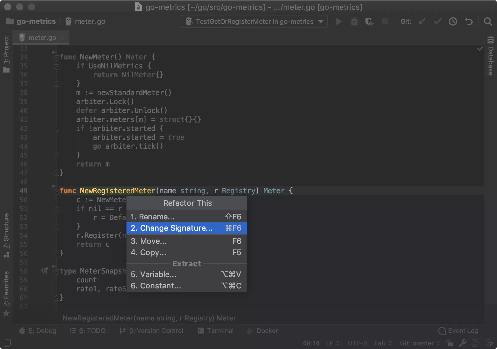
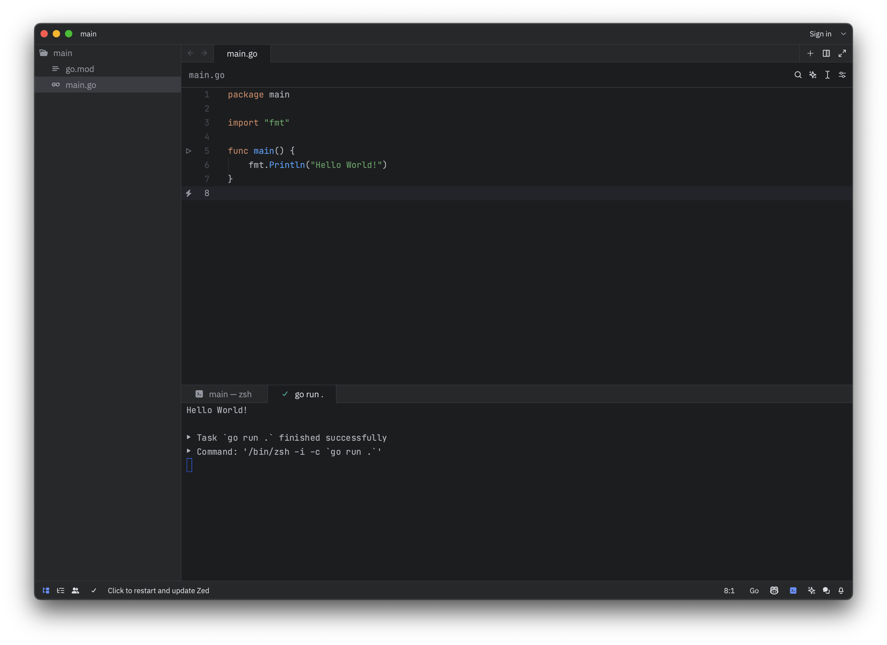
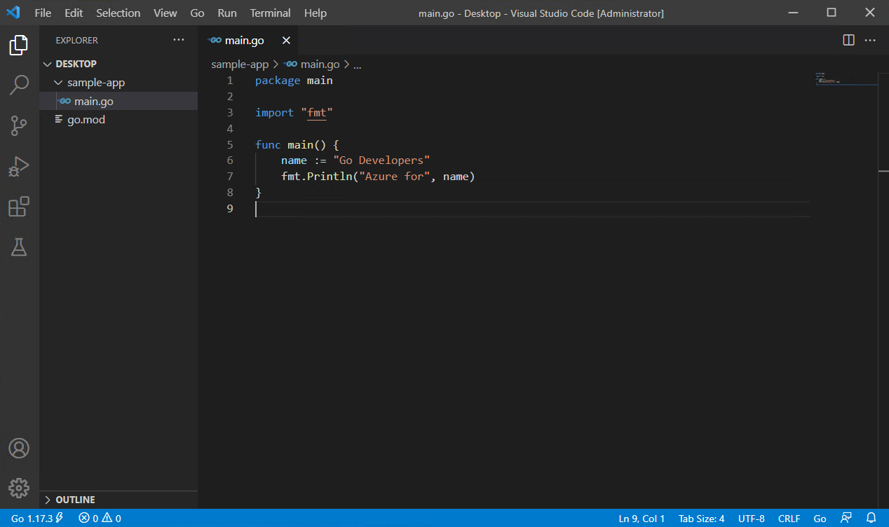
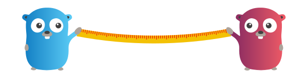

---
hide:
  - navigation
---

# The Go Programming Language

## Introduction

!!! goals "In this hands-on you will learn the basic concepts and syntax of the Go programming language."

    - You are able to develop **simple applications** using the **Go** programming language.
    - You can compile and run **Go** programs on your machine.
    - You have chosen an **IDE** for developing **Go** applications for yourself and know how to use it.

Note that this course is not a complete and comprehensive guide to the Go programming language. It is designed to provide you with a basic understanding of Go and help you get
started with Go for this course. If you want to learn more about Go, you can refer to the official Go documentation and other online resources. This guide is not for 
beginners, but for people who already have some decent programming experience. 

The course is heavily inspired by the [Go by Example](https://gobyexample.com/){target="blank_"} website. The website offers even more examples and explanations about the Go
programming language. If you want to learn more about Go, you should definitely check it out.

!!! duration "The hands-on should be completed in 2-4 hours"
    As this is a repetition of the theory session, the time to spend on this should not exceed **4 hours**.

??? tip "Read tips, they are really useful!"
    Through this hands-on, we provide **useful tips** that might help you during the project. These tips are always provided in boxes like this one.

??? important "Always read the information in these boxes and keep it in mind."
    **Indispensable information** that you will need to keep in mind as you will use that often during the project is always provided in red boxes like this one.

??? task "Complete all tasks"
    The basic idea of this document is to get you started on the Go syntax and additionally instruct you how to install a Go development environment on your computer. So there are 
    tasks in this document that you should complete. These tasks are always provided in boxes like this one.

??? feedback "If you have any questions, need help or found an error, don't hesitate to contact me."
    I will be happy to help you. Just write an email to <a href="mailto:michael.clausen@hevs.ch">michael.clausen@hevs.ch</a> with your feedback.

??? downloads "Downloads"
    - [Slides](downloads/The%20Go%20programming%20language.pdf): PDF version of the slides used in the theory session.

### Why another programming language?

You might wonder why we need another programming language. You learned and used already **Python**, **Java**, **C** and **C++**. So why do we need another one?

A program language is a tool to solve problems. Different languages are better suited for different problems. While **Python** is great for **scripting** and **prototyping**,
**Java** is great for **enterprise applications** and **Android development**. **C** and **C++** are great for **system programming** and **embedded systems**. However, all these
languages are not very well suited for **concurrent**, **distributed** and **communicating micro-services**. This is where **Go** comes into play!


The motivation to use Go extends beyond its **simplicity**, **efficiency**, and **scalability**, encompassing **robust security features** that are crucial in today's software 
landscape, especially for **devices exposed to the internet**. Developed with a focus on secure coding practices, Go offers several key security advantages that make it an 
attractive choice for building secure and resilient applications.


First and foremost, Go's **statically typed** nature and **strict compiler checks** help catch common programming errors at compile time, reducing the likelihood of vulnerabilities 
such as **buffer overflows**, **null pointer dereferences**, and **type mismatches**. This proactive approach to error detection enhances the overall security posture of Go 
applications, making them less susceptible to exploitation. 

Moreover, Go's memory safety features, including **automatic garbage collection** and **bounds checking**, mitigate the risk of memory-related vulnerabilities such as buffer 
overflows and memory leaks. By managing memory allocation and deallocation automatically, Go minimizes the potential for memory corruption vulnerabilities that are commonly 
exploited by attackers.

Additionally, Go's standard library and ecosystem **prioritize secure coding practices** and provide built-in support for common security mechanisms such as **encryption**, 
**authentication**, and **access control**. Whether handling sensitive data or implementing secure communication protocols, developers can leverage Go's robust standard library to 
implement security features without relying on third-party dependencies or external libraries with potential security vulnerabilities.

Furthermore, Go's concurrency model, based on lightweight **goroutines** and **channels**, facilitates the development of secure and scalable concurrent applications. By offering 
a simple yet powerful concurrency mechanism, Go enables developers to write **thread-safe** and **race-condition-free** code, reducing the risk of security vulnerabilities 
associated with concurrent programming.

!!! important "In the case of this course, the Go programming language will help us to implement robust, efficient, secure distributed applications."


### History of the Go programming language

The history of Go, the programming language developed by **Google**, dates back to **2007** when Robert Griesemer, Rob Pike, and Ken Thompson set out to create a language that 
addressed the challenges they faced with existing languages while maintaining their **efficiency** and **simplicity**.


In **2009**, Google officially **announced** the existence of Go, releasing it as an **open-source** project. The language was designed to cater to the growing need for efficient
and scalable programming tools, particularly in the context of **large-scale distributed systems** and **concurrent programming**.

Over the years, Go has undergone significant development and refinement, with regular updates and contributions from a thriving community of developers worldwide. Today, Go 
continues to evolve as a modern programming language, with Google and the Go community actively working to enhance its features, improve its performance, and expand its 
ecosystem of libraries and tools. With its rich history and ongoing development, Go remains a popular choice for developers seeking a robust and efficient platform for building 
**reliable** and **scalable** software solutions.


### Features of the Go programming language

Here's an overview of the key features of Go:


- **Simplicity**: Go's syntax is designed to be clean and minimalistic, making it easy to read, write, and maintain code. It reduces unnecessary complexity, allowing developers to 
  focus on solving problems rather than wrestling with the language itself.


- **Efficiency**: Go offers fast compilation times and efficient runtime performance, making it ideal for building high-performance applications. Its built-in garbage collector
  manages memory allocation and deallocation automatically, optimizing resource usage and minimizing overhead.


- **Concurrency**: Go provides built-in support for concurrency through lightweight goroutines and channels. Goroutines allow developers to execute concurrent tasks efficiently, 
  while channels facilitate communication and synchronization between goroutines. This concurrency model simplifies the development of scalable and concurrent applications.


- **Standard Library**: Go comes with a comprehensive standard library that includes packages for common tasks such as I/O operations, networking, encryption, and more. The 
  standard library is well-designed and efficient, providing developers with powerful tools to build robust applications without relying on third-party dependencies.


- **Static Typing**: Go is statically typed, meaning variable types are known at compile time. This helps catch type-related errors early in the development process, improving 
  code reliability and maintainability.

    

- **Garbage Collection**: Go features automatic garbage collection, which manages memory allocation and deallocation, preventing memory leaks and buffer overflows. This simplifies 
  memory management and reduces the risk of memory-related vulnerabilities.


- **Cross-Platform Compatibility**: Go code can be compiled to run on multiple platforms, including Linux, macOS, Windows, and more. This cross-platform compatibility enables 
  developers to write code once and deploy it anywhere, without worrying about platform-specific nuances.


- **Built-in Testing Support**: Go includes a built-in testing framework that makes it easy to write and execute tests for your code. Testing is an integral part of the Go 
  development workflow, promoting code quality and reliability.


- **Tooling**: Go comes with a set of powerful development tools, including the go command-line tool, the gofmt code formatter, and the go vet static analyzer. These tools 
  streamline the development process and enforce best practices, ensuring consistency and quality across projects.


- **Open-Source Community**: Go has a vibrant open-source community that contributes to its development and ecosystem. There are numerous third-party packages and libraries 
  available for Go, covering a wide range of use cases and domains.

!!! tip "Overall, Go's combination of simplicity, efficiency,  concurrency support, and robust tooling makes it an excellent choice for building modern, scalable, and reliable distributed software solutions."


##  Setting up development environment

Setting up a development environment for Go on Windows, macOS, and Linux is relatively straightforward. Below is a step-by-step guide for each operating system:

=== "Windows"
    1. **Download Go Installer**:
        - Visit the official Go website (https://golang.org/dl/) and download the latest stable release for Windows.
        - Run the installer executable (.msi file) and follow the installation instructions.

    2. **Set Environment Variables**:
        - Open the Control Panel and go to System and Security > System > Advanced system settings.
        - Click on the "Environment Variables" button.
        - Under "System variables", find the "Path" variable and click "Edit".
        - Add the path to the Go binary directory (usually `C:\Go\bin`) to the list of paths.
        - Click "OK" to save the changes.

    3. **Verify Installation**:
        - Open a new command prompt and type `go version`. You should see the installed Go version printed.

=== "macOS"
    1. **Install Homebrew** (optional but recommended):
        - Open Terminal.
        - Install Homebrew by running the following command:
          ```
          /bin/bash -c "$(curl -fsSL https://raw.githubusercontent.com/Homebrew/install/HEAD/install.sh)"
          ```

    2. **Install Go**:
        - Open Terminal.
        - Run the following command to install Go using Homebrew:
          ```
          brew install go
          ```

    3. **Verify Installation**:
        - Open Terminal and type `go version`. You should see the installed Go version printed.

=== "Linux (Ubuntu/Debian)"
    1. **Update package index**:
        - Open Terminal.
        - Update the package index by running:
        ```
        sudo apt update
        ```

    2. **Install Go**:
        
        - Install Go by running:
          ```
          sudo apt install golang
          ```

    3. **Verify Installation**:
        - Open Terminal and type `go version`. You should see the installed Go version printed.

??? task "Install Go and test your setup"
    Install Go on your computer and ensure that the simple "Hello World" program runs successfully. If you encounter any issues during the installation or setup process,
    don't hesitate to ask for help. We take it as given after this task that you have successfully installed Go on your computer and are ready to start development anytime.

    - Install Go on your computer as mentioned above.
    - Create a new directory and navigate to it.
    - Create a new file named `hello.go` and add the following code:
    ```go title="hello.go"
    package main
    
    import "fmt"
    
    func main() {
        fmt.Println("hello world")
    }
    ```

    - Now run the program using the following command:
    ```sh
    go run hello.go
    ```


### IDEs and Editors

While Go can be developed using any text editor, there are several IDEs and editors that provide enhanced support for Go development. Some popular options include:

??? tip "Jetbrains GoLand"
    
    
    GoLand is a full-featured IDE specifically designed for Go development, offering advanced features and tools for writing, testing, and debugging Go code. You can download GoLand 
    from the JetBrains website [https://www.jetbrains.com/go/](https://www.jetbrains.com/go/){target="blank_"}. GoLand is not free software, but it is free for students and open-source projects.

??? tip "Zed"
    
    
    Zed is a lightweight and fast code editor with built-in support for Go development. You can download Zed from the official website 
    [https://zed.dev](https://zed.dev){target="blank_"}. Zed is free and open-source software, making it an excellent choice for developers looking for a simple and efficient 
    code editor. Zed does not offer remote development capabilities yet (The unstable preview version actually does), but it is a good choice for local development.

??? tip "Visual Studio Code"
    
    
    Visual Studio Code is a lightweight and versatile code editor with excellent Go support through extensions like Go for Visual Studio Code. You can download Visual Studio Code from 
    the official website [https://code.visualstudio.com/](https://code.visualstudio.com/). You need to install the Go extension for Visual Studio Code to get Go support.

??? task "Choose and install an IDE"
    Choose an IDE or editor for Go development based on your personal preferences. Install the necessary extensions or plugins to enable Go support in your chosen IDE. If you need
    help setting up your IDE, feel free to ask for assistance.

    - Choose an IDE or editor for Go development.
    - Install the IDE aling with the necessary extensions or plugins for Go support.
    - Familiarize yourself with the basic features and tools available in your chosen IDE.

    We assume that that from this point on, you are able to create new go projects and run them in your IDE.

## Basic Syntax

### Hello World

Our first program will print the classic “hello world” message. Here is the full source code.


```go linenums="1" title="hello.go"
--8<-- "examples/HelloWorld/hello.go"
```

1. Every Go file starts with a `package` declaration. In this case, we use the `main` package, which is the entry point for the executable program.
2. We import the `fmt` package, which contains functions for formatting text and printing output. The `fmt.Println` function is used to print messages to the console.
3. The `main` function is the entry point for the program. When the program is executed, the code inside the `main` function is executed sequentially.
4. The `fmt.Println` function is used to print the message "hello world" to the console.
5. A Go `main()` function does not require a return statement.

??? output "Program output"
    ```
    hello world
    ```

To run the program, put the code in `hello.go` and use `go run`.

```sh
$ go run hello.go
```

??? important "Go programs can be run using the `go run` command."
    To run a Go program, you can use the `go run` command followed by the name of the Go file. This command compiles and runs the program in a single step, making it easy to test 
    and execute Go code. Using an IDE with built-in support for Go development can also simplify the process of running Go programs.

Sometimes we want to build our programs into binaries that can be run without the need of a Go installation. We can do this using `go build`.

```sh
$ go build hello.go
```

This will create an executable binary file named `hello` that can be run directly. If you use just Go native libraries in your application, the binary will be self-contained and
can be run on any machine without the need of a Go installation or any other library dependency.

So we can run the executable binary directly using:

```sh
$ ./hello
```

If we want to build the binary with a different name, we can use the `-o` flag:

```sh
$ go build -o hw hello.go
```

Now the executable binary will be named `hw` and can be run using:

```sh
$ ./hw
```

??? important "Go programs can be compiled into binaries using the `go build` command."
    The `go build` command compiles a Go program into an executable binary file. This binary can be run directly on the target platform without the need for the Go runtime. The 
    resulting binary file will have the same name as the Go source file without the `.go` extension by default. The flag `-o` allows you to specify a custom name for the binary.

??? tip "Go binaries are self-contained and can be run on any machine."
    Go binaries are self-contained and do not require the Go runtime to be installed on the target machine. This makes it easy to distribute and run Go programs on different 
    platforms without worrying about dependencies or compatibility issues. The resulting binary file can be executed directly on any machine that supports the target platform.


### Values

Go has various **value** types including **strings**, **integers**, **floats**, **booleans**, etc.


Here are a few basic examples of values in Go: 

```go linenums="1"
--8<-- "examples/Values/main.go"
```

1. Strings, which can be added together with +.
2. Integers.
3. Floats.
4. Booleans, with boolean operators as you’d expect.

??? output "Program output"
    ```
    golang
    2+2 = 4
    7.0/3.0 = 2.3333333333333335
    false
    true
    false
    ```

### Variables

In Go, **variables** are explicitly declared and used by the compiler to e.g. check type-correctness of function calls.


The `var` statement declares one or multiple variables. While the keyword `var`is mandatory for package global variables, the `:=` syntax is a shorthand for declaring and 
initializing a variable, e.g. `var f string = "apple"` can be replaced by `f := "apple"`. In that case, Go will infer the type of initialized variables.

```go linenums="1"
--8<-- "examples/Variables/main.go"
```

1. `var` declares 1 or more variables.
2. You can declare multiple variables at once.
3. Go will infer the type of initialized variables.
4. Variables declared without a corresponding initialization are **zero-valued**. For example, the zero value for an int is 0.
5. The `:=` syntax is shorthand for declaring and initializing a variable, e.g. for `var f string = "apple"` in this case. This syntax is only available inside functions.

??? output "Program output"
    ```
    initial
    1 2
    true
    0
    apple
    ```

The basic data types in Go are:

| Type          | Description                                                                                                                   |
|---------------|-------------------------------------------------------------------------------------------------------------------------------|
| `bool`        | The boolean type, which represents true or false values.                                                                      |
| `string`      | The string type, which represents a sequence of characters.                                                                   |
| `int`         | The integer type, which represents whole numbers. Note that the size of `int` depends on the platform.                        |
| `int8`        | The 8-bit integer type, which represents whole numbers in the range -128 to 127.                                              |
| `int16`       | The 16-bit integer type, which represents whole numbers in the range -32768 to 32767.                                         |
| `int32`       | The 32-bit integer type, which represents whole numbers in the range -2147483648 to 2147483647.                               |
| `int64`       | The 64-bit integer type, which represents whole numbers in the range -9223372036854775808 to 9223372036854775807.             |
| `uint`        | The unsigned integer type, which represents non-negative whole numbers. Note that the size of `uint` depends on the platform. |
| `uint8`       | The 8-bit unsigned integer type, which represents non-negative whole numbers in the range 0 to 255.                           |
| `uint16`      | The 16-bit unsigned integer type, which represents non-negative whole numbers in the range 0 to 65535.                        |
| `uint32`      | The 32-bit unsigned integer type, which represents non-negative whole numbers in the range 0 to 4294967295.                   |
| `uint64`      | The 64-bit unsigned integer type, which represents non-negative whole numbers in the range 0 to 18446744073709551615.         |
| `float32`     | The 32-bit floating-point type, which represents decimal numbers with single precision.                                       |
| `float64`     | The 64-bit floating-point type, which represents decimal numbers with double precision.                                       |
| `byte`        | The byte type, which is an alias for `uint8` and represents a single byte.                                                    |
| `rune`        | The rune type, which is an alias for `int32` and represents a Unicode code point.                                             |
| `uintptr`     | The unsigned integer type, which is large enough to hold the bit pattern of any pointer.                                      |
| `error`       | The error type, which represents an error value that can be returned from functions.                                          |
| `interface{}` | The empty interface type, which represents an interface with no methods.                                                      |

??? important "Go is a statically typed language."
    Go is a **statically typed** language, which means that variable types are known at compile time. This allows the compiler to catch type-related errors early in the development 
    process, improving code reliability and maintainability.

??? important "Go uses type inference."
    Go supports **type inference**, which allows the compiler to infer the type of a variable based on its initialization value. This reduces the need for explicit type declarations and 
    makes the code more concise and readable. Type inference is commonly used in Go to declare variables without specifying their types explicitly. `:=` is used for type inference.

??? important "Go variables are zero-valued by default."
    In Go, variables declared without an explicit initialization value are **zero-valued**. The zero value of a variable depends on its type, such as 0 for integers, false for 
    booleans, and "" for strings.

??? important "There is no implicit type conversion in Go."
    Go does not allow implicit type conversion between different types (like in C++). This means that you cannot assign a value of one type to a variable of another type without 
    an explicit conversion. This helps prevent type-related errors and ensures type safety in Go programs.

??? tip "Go supports short variable declarations using `:=`."
    Go provides a **shorthand syntax** for declaring and initializing variables using the `:=` operator. This syntax is commonly used to declare and initialize variables within 
    functions without explicitly specifying the type (type inference).

??? tip "Go variables must be used."
    In Go, variables that are declared but not used will result in a **compilation error**. This helps ensure that all variables are used correctly and prevents unused variables from 
    cluttering the codebase.

??? tip "You can declare multiple package global variables inside a `var` block."
    Go allows you to declare multiple global variables inside a `var` block. This can be useful for grouping related variables together and improving code readability. Example:

    ```go
    var (
        a int32
        b float64
    )
    ```

### Constants

Go supports **constants** of **character**, **string**, **boolean**, and **numeric** values.


Constants are declared like variables, but with the `const` keyword.

```go linenums="1"
--8<-- "examples/Constants/main.go"
```

1. `const` declares a constant value.
2. `const` declaration can be grouped.
3. A `const` statement can appear anywhere a `var` statement can.
4. Constant expressions perform arithmetic with arbitrary precision.
5. A numeric constant has no type until it’s given one, such as by an explicit conversion.
6. number can be given a type by using it in a context that requires one, such as a variable assignment or function call. For example, here math.Sin expects a float64.

??? output "Program output"
    ```
    constant
    6e+11
    600000000000
    -0.28470407323754404
    ```

Go provides the following built-in numeric constants like `math.Pi`, `math.E`, `math.Phi`, and `math.Sqrt2` in the `math`package.

??? important "Go constants are immutable."
    Go constants are immutable values that cannot be changed or reassigned once they are declared. This immutability ensures that constants retain their values throughout the 
    program's execution, making them suitable for defining fixed values that should not be modified.

??? important "Go constants do not have a type until they are given one."
    Unlike variables, Go constants do not have an explicit type until they are used in a context that requires one. This allows constants to be used in a flexible manner without 
    being tied to a specific type until necessary.

??? important "Go constants are evaluated at compile time."
    Go constants are evaluated at compile time, which means that constant expressions are computed and resolved during the compilation process. This ensures that constants are 
    resolved efficiently and accurately without runtime overhead.

### For

`for` is Go’s only looping construct. 


Here are some basic types of `for` loops:

```go linenums="1"
--8<-- "examples/For/main.go"
```

1. The most basic type, with a single condition.
2. A classic initial/condition/after for loop.
3. Another way of accomplishing the basic “do this N times” iteration is range over an integer.
4. `for` without a condition will loop repeatedly until you `break` out of the loop or `return` from the enclosing function.
5. You can also `continue` to the next iteration of the loop.

??? output "Program output"
    ```
    1
    2
    3
    0
    1
    2
    range 0
    range 1
    range 2
    loop
    1
    3
    5
    ```

??? important "Go has only one looping construct: the `for` loop."
    Go has only one looping construct: the `for` loop. The `for` loop in Go is flexible and powerful, allowing you to create a wide range of loop patterns using different 
    combinations of loop conditions, initializations, and post-statements.

??? important "In go, for loop headers do not need to be surrounded by parentheses."
    In Go, the `for` loop headers do not need to be surrounded by parentheses, unlike some other programming languages. This makes the loop syntax more concise and readable, 
    especially for simple loop conditions. However go requires braces `{}` around the loop body.

!!! tip "We’ll see some other for forms later when we look at range statements, channels, and other data structures."

### If/Else

Branching with `if` and `else` in Go is straight-forward.


Here are some basic examples:

```go linenums="1"
--8<-- "examples/IfElse/main.go"
```

1. Here’s a basic example.
2. You can have an `if` statement without an `else`.
3. Logical operators like `&&` and `||` are often useful in conditions.
4. A statement can precede conditionals; any variables declared in this statement are available in the current and all subsequent branches.

??? output "Program output"
    ```
    7 is odd
    8 is divisible by 4
    either 8 or 7 are even
    9 has 1 digit
    ```

??? important "Go requires braces around the body of the `if` and `else` blocks."
    In Go, the body of the `if` and `else` blocks must be enclosed in braces `{}`. This is a syntactic requirement in Go to ensure that the code is well-structured and readable. 
    The use of braces also helps prevent common errors related to block scoping and conditional logic. However the `()` brackets around the condition are optional.

??? important "Go has no ternary if"
    Go does not have a ternary `if`, so you’ll need to use a full `if` statement even for basic conditions. This is a deliberate design choice in Go to promote code readability and
    maintainability by avoiding complex and nested ternary expressions. If you really need a ternary operator, you can use a map to simulate it:

    ```go
    value := map[bool]int{true: 1, false: 0}[condition]
    ```
    
    In the example code above, the `value` variable will be assigned the value `1` if the `condition` is `true`, and `0` if the `condition` is `false`.


### Switch

**Switch** statements express conditionals across many branches.


Switch statements in Go are similar to those in C, C++, Java, JavaScript, and other languages. A big difference is that Go only runs the selected case, not all the cases that 
follow like the languages mentioned before. This is a feature that helps avoid common bugs when the developer forgets to add a `break` statement. If you want to fall through to
the next case, you need to use the `fallthrough` statement.

Here are some basic examples:

```go linenums="1"
--8<-- "examples/Switch/main.go"
```

1. Imports can be grouped into a parenthesized, "factored" import statement.
2. Here’s a basic switch.
3. You can use commas to separate multiple expressions in the same `case` statement. We use the optional `default` case in this example as well.
4. `switch` without an expression is an alternate way to express if/else logic. Here we also show how the `case` expressions can be non-constants.
5. A type `switch` compares types instead of values. You can use this to discover the type of an interface value. In this example, the variable `t` will have the type corresponding 
   to its clause.

??? output "Program output"
    ```
    Write 2 as two
    It's a weekday
    It's after noon
    I'm a bool
    I'm an int
    Don't know type string
    ```

??? important "Go’s switch cases break automatically"
    In Go, the `break` statement is not required in each case of a `switch` statement. The switch cases break automatically after executing the corresponding code block, making it 
    easier to write concise and readable code. If you want to fall through to the next case, you can use the `fallthrough` statement.

??? tip "A switch without expression is an alternate way to express if/else logic."
    Go allows you to use a `switch` statement without an expression, which is an alternate way to express if/else logic. This form of `switch` can be useful for writing concise 
    conditional statements based on complex conditions.

??? tip "Go's switch statement does not need to be surrounded by parentheses."
    In Go, the `switch` statement does not need to be surrounded by parentheses, unlike some other programming languages. This makes the switch syntax more concise and readable, 
    especially for simple switch cases. The use of braces `{}` around the switch body however is required.

??? tip "Go’s type switch is a powerful feature for working with interfaces."
    Go’s type switch allows you to inspect the type of an interface value at runtime and take different actions based on the type. This feature is particularly useful when working 
    with interfaces and handling values of unknown types.


### Arrays

In Go, an **array** is a numbered sequence of elements of a specific length. In typical Go code, slices are much more common; arrays are useful in some special scenarios.


Arrays in Go are similar to arrays in other languages like C, C++, and Java. However, Go arrays are fixed-length and zero-valued by default, meaning that each element of the array
is initialized to the zero value of its type and the index is always checked on access.

```go linenums="1"
--8<-- "examples/Arrays/main.go"
```

1. Here we create an array a that will hold exactly 5 ints. The type of elements and length are both part of the array’s type. By default an array is zero-valued, which for `ints` 
   means 0s.
2. We can set a value at an index using the `array[index] = value` syntax, and get a value with `array[index]`.
3. The builtin `len` returns the length of an array.
4. Use this syntax to declare and initialize an array in one line.
5. Array types are one-dimensional, but you can compose types to build multi-dimensional data structures.

??? output "Program output"
    ```
    emp: [0 0 0 0 0]
    set: [0 0 0 0 100]
    get: 100
    len: 5
    dcl: [1 2 3 4 5]
    2d:  [[0 1 2] [1 2 3]]
    ```

??? important "Arrays in Go are fixed-length and zero-valued by default."
    In Go, arrays are fixed-length sequences of elements with a specific type. The length of an array is part of its type, and arrays are zero-valued by default, meaning that each 
    element is initialized to the zero value of its type. The fixed-length nature of arrays makes them less flexible than slices, which can grow and shrink dynamically.

??? tip "Go arrays are rarely used directly in practice."
    While arrays are a fundamental data structure in Go, they are rarely used directly in practice due to their fixed length and limited flexibility. Instead, slices are more 
    commonly used for working with sequences of elements in Go, as they provide a more dynamic and versatile interface to data.

!!! tip "Arrays appear in the form `[v1 v2 v3 ...]` when printed with `fmt.Println`."


### Slices

**Slices** are an important data type in Go, giving a more powerful interface to sequences than arrays.


Slices in Go can be compared to `std::vector` in C++. They can grow and shrink in size and provide a more flexible and dynamic way to work with sequences of elements. Slices are
a key feature of Go and are widely used in Go programs for managing collections of data.

```go linenums="1"
--8<-- "examples/Slices/main.go"
```

1. Unlike arrays, slices are typed only by the elements they contain (not the number of elements). An uninitialized slice equals to nil and has length 0.
2. To create an empty slice with non-zero length, use the builtin `make`. Here we make a slice of `strings` of length 3 (initially zero-valued). By default a new slice’s capacity 
   is equal to its length; if we know the slice is going to grow ahead of time, it’s possible to pass a capacity explicitly as an additional parameter to `make`.
3. We can set and get just like with arrays.
4. `len` returns the length of the slice as expected.
5. In addition to these basic operations, slices support several more that make them richer than arrays. One is the builtin `append`, which returns a slice containing one or more 
   new values. Note that we need to accept a return value from append as we may get a new slice value.
6. Slices can also be copy’d. Here we create an empty slice c of the same length as s and copy into c from s.
7. Slices support a “slice” operator with the syntax `slice[low:high]`. For example, this gets a slice of the elements `s[2]`, `s[3]`, and `s[4]`.
8. This slices up to (but excluding) `s[5]`.
9. And this slices up from (and including) `s[2]`.
10. We can declare and initialize a variable for slice in a single line as well.
11. The `slices` package contains a number of useful utility functions for slices.
12. Slices can be composed into multi-dimensional data structures. The length of the inner slices can vary, unlike with multi-dimensional arrays.
13. Note that while slices are different types than arrays, they are rendered similarly by `fmt.Println`.

??? output "Program output"
    ```
    uninit: [] true true
    em: [  ] le: 3 ca: 3
    set: [a b c]
    get: c
    len: 3
    apd: [a b c d e f]
    cpy: [a b c d e f]
    sl1: [c d e]
    sl2: [a b c d e]
    sl3: [c d e f]
    dcl: [g h i]
    t == t2
    2d:  [[0] [1 2] [2 3 4]]
    ```

??? important "Slices are the default when working with sequences in Go."
    Slices are more flexible than arrays in Go, providing a dynamic and versatile interface to sequences of elements. Slices can grow and shrink dynamically, making them suitable 
    for working with collections of varying sizes and lengths. Slices are commonly used in Go for managing sequences of elements efficiently. The functionality of slices is
    very similar to the one of `std::vector` in C++.

??? important "Slices are typed by the elements they contain."
    All elements of a slice have to be of the same type in Go. Using `interface{}` as the type of a slice allows you to store values of different types in the same slice, but you
    will need to perform type assertions when accessing the values. Go generics can make this easier, as we see later here.
 
??? tip "Slices appear in the form `[v1 v2 v3 ...]` when printed with `fmt.Println`."


### Maps

**Maps** are Go’s built-in associative data type (sometimes called hashes or dicts in other languages).


Maps are a powerful and versatile data structure in Go that allow you to store key/value pairs and efficiently retrieve values based on keys. Maps provide a convenient way to
implement associative arrays, dictionaries, and other data structures that require fast lookups and retrievals.

```go linenums="1"
--8<-- "examples/Maps/main.go"
```

1. To create an empty map, use the builtin `make`: `make(map[key-type]val-type)`.
2. Set key/value pairs using typical `name[key] = val` syntax.
3. Printing a map with e.g. `fmt.Println` will show all of its key/value pairs.
4. Get a value for a key with `name[key]`.
5. If the key doesn’t exist, the **zero value** of the value type is returned.
6. The builtin `len` returns the number of key/value pairs when called on a map.
7. The builtin `delete` removes key/value pairs from a map.
8. To remove all key/value pairs from a map, use the `clear` builtin.
9. The optional second return value when getting a value from a map indicates if the key was present in the map. This can be used to disambiguate between missing keys and keys with 
   zero values like 0 or "". Here we didn’t need the value itself, so we ignored it with the **blank identifier** `_`.
10. You can also declare and initialize a new map in the same line with this syntax.
11. The `maps` package contains a number of useful utility functions for maps.

??? output "Program output"
    ```
    map: map[k1:7 k2:13]
    v1: 7
    v3: 0
    len: 2
    map: map[k1:7]
    map: map[]
    prs: false
    map: map[bar:2 foo:1]
    n == n2
    ```

??? important "Maps are unordered collections of key/value pairs."
    Maps in Go are unordered collections of key/value pairs, where each key is unique within the map. Maps provide an efficient way to store and retrieve values based on a key, 
    making them suitable for implementing associative arrays and dictionaries.

??? important "Go maps are reference types."
    Maps in Go are reference types, meaning that when you assign a map to a new variable or pass it as an argument to a function, you are working with a reference to the original 
    map. This allows you to modify the map's contents and have the changes reflected in all references to the map.

??? tip "Maps appear in the form `map[k:v k:v]` when printed with `fmt.Println`."


### Range

**range** iterates over elements in a variety of data structures.



Let’s see how to use range with some of the data structures we’ve already learned:

```go linenums="1"
--8<-- "examples/Range/main.go"
```

1. Here we use `range` to sum the numbers in a slice. Arrays work like this too.
2. `range` on `arrays` and slices provides both the index and value for each entry. Above we didn’t need the index, so we ignored it with the blank identifier `_`. Sometimes we 
   actually want the indexes though.
3. `range` on `map` iterates over key/value pairs.
4. `range` can also iterate over just the keys of a map.
5. `range` on `strings` iterates over Unicode code points. The first value is the starting byte index of the rune and the second the rune itself.

??? output "Program output"
    ```
    sum: 9
    index: 1
    a -> apple
    b -> banana
    key: a
    key: b
    0 103
    1 111
    ```

??? important "The `range` keyword is used to iterate over elements in data structures."
    The `range` keyword in Go is used to iterate over elements in data structures such as arrays, slices, maps, and strings. The `range` keyword provides a convenient way to loop 
    over the elements of a data structure without having to manage the index or length explicitly. The `range` keyword is commonly used in Go for iterating over collections of 
    elements efficiently.

??? tip "The `range` keyword returns the index and value of each element."
    When using the `range` keyword, Go returns the index and value of each element in the data structure being iterated over. This allows you to access both the index and value of
    each element within the loop body.

??? tip "The blank identifier `_` can be used to ignore the index or value in a `range` loop."
    If you are not interested in the index or value returned by the `range` keyword, you can use the blank identifier `_` to ignore the value. This allows you to focus on the 
    elements that are relevant to your code and avoid unnecessary variables.


### Functions

**Functions** are central in Go.


We’ll learn about functions with a few different examples:

```go linenums="1"
--8<-- "examples/Functions/main.go"
```

1. Here’s a function that takes two `ints` and returns their sum as an `int`.
2. Go requires explicit `returns`, i.e. it won’t automatically return the value of the last expression.
3. When you have multiple consecutive parameters of the same type, you may omit the type name for the like-typed parameters up to the final parameter that declares the type.
   A function can return any number of results, in this case the result and an error value.
4. Call a function just as you’d expect, with `name(args)`.
5. You can save a function to a variable and call the function through that variable.
6. You can define an `init()` function for each package. `init()` functions are executed automatically when the package is initialized (even before main is called), and they are 
   commonly used for setting up package-level variables and performing initialization tasks.

??? output "Program output"
    ```
    init() called
    1+2 = 3
    1+2+3 = 6
    3
    ```

??? important "Go functions are first-class citizens."
    Functions in Go are first-class citizens, meaning that functions can be assigned to variables, passed as arguments to other functions, and returned from other functions. This 
    flexibility allows you to work with functions in a similar way to other data types, making functions a powerful and versatile feature of the language.

??? tip "The `init()` function is used for package initialization tasks."
    The `init()` function in Go is a special function that is executed automatically when the package is initialized. The `init()` function is commonly used for performing 
    initialization tasks, setting up package-level variables, and executing code that needs to run before the `main()` function is called. The `init()` function is executed only 
    once per package, even if the package is imported multiple times.

??? tip "Go return values can be ignored us the blank identifier `_`."
    If you are not interested in the return value of a function, you can use the blank identifier `_` to ignore the value. This allows you to focus on the values that are relevant 
    to your code and avoid unnecessary variables.


### Multiple Return Values

Go has built-in support for **multiple return values**. This feature is used often in idiomatic Go, for example to return both result and error values from a function.


Lets look at a function that returns 2 values:

```go linenums="1"
--8<-- "examples/MultipleReturnValues/main.go"
```

1. The `(int, int)` in this function signature shows that the function returns 2 `ints`.
2. Here we use the 2 different return values from the call with multiple assignment.
3. If you only want a subset of the returned values, use the blank identifier `_`.

??? output "Program output"
    ```
    3
    7
    7
    ```

??? important "Go functions can return multiple values."
    Go functions can return multiple values, allowing you to return more than one result from a function. This feature is commonly used to return both the result of a computation 
    and an error value, enabling functions to provide detailed information about their execution status.

??? important "Multiple return values are often used to return both a result and an error value from a function."
    In Go, multiple return values are often used to return both a result and an error value from a function. This pattern allows functions to provide detailed error information
    when necessary, making it easier to handle errors and exceptions in Go code.

??? tip "The blank identifier `_` can be used to ignore specific return values when calling a function."
    When calling a function that returns multiple values, you can use the blank identifier `_` to ignore specific return values that you are not interested in. This allows you to 
    focus on the values that are relevant to your code.

??? tip "Named return values can be used to improve code readability."
    Go allows you to specify named return values in function signatures, which can improve code readability by providing descriptive names for the returned values. Named return 
    values are particularly useful when a function returns multiple values, making it easier to understand the purpose of each returned value.


### Pointers

For all those who thought that Go would save them from using pointers, here is some bad news: Go does not only supports **pointers**, they are used quite regularly.


Pointers allow you to pass references to values and records within your program. This can be more efficient than passing values directly, especially for large data structures.
If a function needs to modify a variable, a pointer to the variable must be passed to the function.

In contrast to C and C++, Go does not need you to manage your memory manually. The garbage collector takes care of that for you, so no memory leaks or invalid memory accesses
should occur. However, you still can reference a nil pointer, which will cause a runtime panic.

```go linenums="1"
--8<-- "examples/Pointers/main.go"
```

1. We’ll show how pointers work in contrast to values with 2 functions: `zeroval` and `zeroptr`. `zeroval` has an `int` parameter, so arguments will be passed to it by value.
   `zeroval` will get a copy of `ival` distinct from the one in the calling function.
2. `zeroptr` in contrast has an `*int` parameter, meaning that it takes an int pointer. The `*iptr` code in the function body then **dereferences** the pointer from its memory
   address to the current value at that address. Assigning a value to a dereferenced pointer changes the value at the referenced address.
3. The `&i` syntax gives the memory **address** of `i`, i.e. a pointer to `i`.
4. Pointers can be printed too.

??? output "Program output"
    ```
    initial: 1
    zeroval: 1
    zeroptr: 0
    pointer: 0x14000110018
    ```

`zeroval` doesn’t change the `i` in `main`, but `zeroptr` does because it has a reference to the memory address for that variable.

??? important "Go supports pointers for managing memory addresses."
    Go supports pointers, which are variables that store memory addresses. Pointers allow you to pass references to values and records within your program, enabling you to work with 
    memory addresses directly. Pointers are commonly used in Go for managing memory efficiently and sharing data between functions.

??? important "The `&` operator is used to get the memory address of a variable."

??? important "The `*` operator is used to dereference a pointer and access the value at the memory address."

??? important "Go pointers are used to pass references to values and records."
    Go pointers are used to pass references to values and records within your program, allowing you to work with memory addresses directly. Pointers provide a way to share data 
    between functions and manage memory efficiently, making them a powerful feature of the language.

??? tip "Memory allocation in Go is managed by the garbage collector."
    Go uses a garbage collector to manage memory allocation and deallocation, which means that you do not need to manually allocate or deallocate memory in Go. The garbage collector 
    automatically reclaims memory that is no longer in use, making memory management easier and more reliable in Go. Dereferencing nil pointers still gets you what you deserve...


### Structs

Go’s **structs** are typed collections of fields. They’re useful for grouping data together to form records.


Structs in Go behave very similar to structs in C, C++, and other languages. They allow you to define custom data types that group together related fields and values. Structs are
used to represent objects and entities in a program, enabling you to create complex data structures with multiple fields and values.

```go linenums="1"
--8<-- "examples/Structs/main.go"
```

1. This `person` struct type has `name` and `age` fields.
2. `newPerson` constructs a new person struct with the given name.
3. You can safely return a pointer to local variable as a local variable will survive the scope of the function.
4. This syntax creates a new `struct`.
5. You can name the fields when initializing a struct.
6. Omitted fields will be **zero-valued**.
7. An `&` prefix yields a pointer to the struct.
8. It’s idiomatic to encapsulate new struct creation in constructor functions.
9. Access struct fields with a **dot**.
10. You can also use dots with struct pointers - the pointers are `automatically dereferenced`.
11. Structs are mutable.
12. If a struct type is only used for a single value, we don’t have to give it a name. The value can have an **anonymous struct type**.

??? output "Program output"
    ```
    {Bob 20}
    {Alice 30}
    {Fred 0}
    &{Ann 40}
    &{Jon 42}
    Sean
    50
    51
    {Rex true}
    ```

??? important "Go structs can be used to define custom data types."
    Go structs are used to define custom data types that group together related fields and values. Structs allow you to create complex data structures with multiple fields and 
    values, enabling you to represent objects and entities in a program. Structs in Go are very similar to structs in C.

??? important "Go structs are typed collections of fields."
    Go structs are typed collections of fields that allow you to group data together to form records. Structs are used to define custom data types in Go, enabling you to create 
    complex data structures with multiple fields and values. Structs are a fundamental feature of Go and are commonly used to represent objects and entities in a program.

??? tip "Field visibility is controlled by the first letter of the field name."
    As we see later, the visibility of struct fields is controlled by the first letter of the field name. Fields that start with an uppercase letter are **exported** and can be 
    accessed from outside the package, while fields that start with a lowercase letter are **unexported** and can only be accessed from within the package. This convention helps 
    enforce encapsulation and data hiding in Go programs.


### Methods

Go supports **methods** defined on struct types.


In contrast to C++, Go does not have classes. However, you can define methods on struct types. Methods in Go are functions that are associated with a specific struct type, allowing
you to define custom behavior for struct values. Methods provide a way to encapsulate behavior and functionality within a struct type, making it easier to work with struct values
and objects.

```go linenums="1"
--8<-- "examples/Methods/main.go"
```

1. This area method has a receiver type of `*rect`. This is required if the method wants to change any field of the struct.
2. Methods can be defined for either **pointer** or **value** receiver types. Here’s an example of a value receiver.
3. Here we call the 2 methods defined for our struct.
4. Go automatically handles conversion between values and pointers for method calls. You may want to use a pointer receiver type to avoid copying on method calls or to allow the
   method to mutate the receiving struct.

??? output "Program output"
    ```
    area:  50
    perim: 30
    area:  50
    perim: 30
    ```

??? important "Go methods are functions associated with a type."
    Go methods are functions that are associated with a specific struct type. Methods in Go allow you to define functions that operate on struct values, enabling you to encapsulate 
    behavior and functionality within a struct type. Methods are a powerful feature of Go that allow you to define custom behavior for struct types.

??? important "Go methods can have pointer or value receivers."
    Go methods can have either pointer or value receivers, allowing you to define methods that operate on struct values or pointers to struct values. Pointer receivers are commonly 
    used to avoid copying values when calling methods or to allow methods to modify the receiving struct. Value receivers are used when you want to work with a copy of the struct 
    value.

??? tip "Go automatically handles conversion between values and pointers for method calls."

??? tip "Go methods can be defined for any named type in Go."
    Go methods can be defined for any named type in Go, not just structs. This allows you to define methods for custom types, built-in types, and even types from external packages. 
    Methods in Go provide a flexible way to define behavior for types and enable you to create custom APIs and interfaces for your programs.


### Interfaces

**Interfaces** are named collections of method signatures.


Like interfaces in Java or C#, Go interfaces define a set of methods that a type must implement to satisfy the interface. Interfaces in Go provide a way to define behavior for 
types without specifying the implementation details, enabling you to define custom APIs and interfaces for your programs.

```go linenums="1"
--8<-- "examples/Interfaces/main.go"
```

1. Here’s a basic interface for geometric shapes.
2. For our example we’ll implement this interface on `rect` and `circle` types.
3. To implement an interface in Go, we just need to implement all the methods in the interface. Here we implement geometry on `rects`.
4. The implementation for `circles`.
5. If a variable has an interface type, then we can call methods that are in the named interface. Here’s a generic measure function taking advantage of this to work on any
   `geometry`.
6. The `circle` and `rect` struct types both implement the `geometry` interface so we can use instances of these structs as arguments to `measure`.

??? output "Program output"
    ```
    {3 4}
    12
    14
    {5}
    78.53981633974483
    31.41592653589793
    ```

??? important "Go interfaces are named collections of method signatures."
    Go interfaces are named collections of method signatures that define a set of methods that a type must implement to satisfy the interface. Interfaces in Go provide a way to 
    define behavior for types without specifying the implementation details, enabling you to define custom APIs and interfaces for your programs.

??? important "Go interfaces are implemented implicitly."
    Go interfaces are implemented implicitly, meaning that a type automatically satisfies an interface if it implements all the methods in the interface. This allows you to define 
    custom behavior for types without explicitly declaring that the type implements the interface. This is fundamentally different from explicit interface implementation in
    languages you already know like Python, Java and C++.


### Struct Embedding

Go supports **embedding** of structs and interfaces to express a more seamless **composition of types**.


From a point of view of a C++ developer, this is similar to **inheritance**. However, Go does not support inheritance in the traditional sense. Instead, Go uses composition and
embedding to achieve code reuse and polymorphism.

```go linenums="1"
--8<-- "examples/StructEmbedding/main.go"
```

1. A `container` embeds a `base`. An embedding looks like a **field without a name**.
2. When creating structs with literals, we have to initialize the embedding explicitly; here the embedded type serves as the field name.
3. We can access the base’s fields directly on `co`, e.g. `co.num`.
4. Alternatively, we can spell out the full path using the embedded type name.
5. Since `container` embeds `base`, the methods of `base` also become methods of a `container`. Here we invoke a method that was embedded from `base` directly on `co`.
6. Embedding structs with methods may be used to bestow interface implementations onto other structs. Here we see that a container now implements the `describer` interface because
   it embeds `base`.

??? output "Program output"
    ```
    co={num: 1, str: some name}
    also num: 1
    describe: base with num=1
    describer: base with num=1
    ```

??? important "Go does not support inheritance."
    Go does not support inheritance or derivation in the traditional sense. Instead, Go uses **composition** and **embedding** to achieve code reuse and polymorphism. Embedding 
    allows you to compose types by including other types as fields within a struct, enabling you to reuse code and behavior across different types.

??? important "Go struct embedding is used to compose types and share behavior."
    Go struct embedding is used to compose types and share behavior between different types. By embedding one struct within another, you can include the fields and methods of the 
    embedded struct in the outer struct, allowing you to reuse code and behavior across different types. Struct embedding is a powerful feature of Go that enables you to create 
    complex data structures and objects with shared behavior.

??? tip "Go interfaces can be implemented implicitly through embedding."
    Go interfaces can be implemented implicitly through embedding, allowing you to define custom behavior for types without explicitly declaring that the type implements the 
    interface. This feature makes it easy to define custom APIs and interfaces for your programs, enabling you to work with different types in a seamless and flexible way.


### Visibility

In Go, **visibility** is controlled only at the **package level**. Inside the same package you can access any variable, function, type, etc. without any restrictions. However, 
if you want to access an entity from another package, you need to make it **exported**. An entity is **exported** if its name **starts with a capital letter**. When importing a 
package, you can only access its exported names, thus everything starting with a capital letter.


```go linenums="1"
--8<-- "examples/Visibility/main.go"
```

1. In this example, the `Shape` interface is exported because its name starts with a capital letter.
2. All methods of the Shape interface are exported because they start with a capital letter too.
3. The `rectangle` struct is not exported because its name starts with a lowercase letter. 
4. The `NewRectangle` function is exported because its name starts with a capital letter.
5. All methods of the `rectangle` struct are exported because their names start with a capital letter.

!!! important "Go visibility is controlled at the package level."

??? important "Exported names in Go start with a capital letter."
    In Go, exported names start with a capital letter, while unexported names start with a lowercase letter. Exported names are accessible from other packages, while unexported 
    names are only accessible within the same package.


### Errors

In Go it’s idiomatic to communicate **errors** via an **explicit, separate return value**. This contrasts with the exceptions
used in languages like Python, Java and C++ and the overloaded single result / error value sometimes used in C. Go’s approach makes
it easy to see which functions return errors and to handle them using the same language constructs employed for other, non-error tasks.


See the documentation of the `errors` package for additional details.

```go linenums="1"
--8<-- "examples/Errors/main.go"
```

1. By convention, errors are the last return value and have type `error`, a built-in interface.
2. **errors.New** constructs a basic error value with the given error message.
3. A `nil` value in the `error` position indicates that there was **no error**.
4. A **sentinel error** is a predeclared variable that is used to signify a specific error condition.
5. We can wrap errors with higher-level errors to add context. The simplest way to do this is with the `%w` verb in `fmt.Errorf`. Wrapped errors create a logical chain (A wraps B,
   which wraps C, etc.) that can be queried with functions like `errors.Is` and `errors.As`.
6. It’s common to use an **inline error check** in the `if` line.
7. `errors.Is` checks that a given `error` (or any error in its chain) matches a specific `error` value. This is especially useful with wrapped or nested errors, allowing you to
   identify specific error types or sentinel errors in a chain of errors.

??? output "Program output"
    ```
    f worked: 10
    f failed: can't work with 42
    Tea is ready!
    Tea is ready!
    We should buy new tea!
    Tea is ready!
    Now it is dark. 
    ```

??? important "Go uses explicit error handling instead of exceptions."
    Go uses explicit error handling instead of exceptions to manage errors in programs. By returning errors as separate values from functions, Go makes it easy to see which functions
    return errors and to handle them using the same language constructs employed for other tasks. This approach simplifies error handling and makes it easier to write robust and 
    reliable code.

??? important "Go uses sentinel errors to represent specific error conditions."
    Go uses sentinel errors, which are predeclared variables that represent specific error conditions, to signify common error states in programs. Sentinel errors are used to 
    communicate specific error conditions to the caller and to provide a consistent way to handle errors in Go code.


### Panic

A **panic** typically means something went unexpectedly wrong. Mostly we use it to fail fast on errors that shouldn’t occur during normal operation, or that we aren’t prepared to 
handle gracefully.


```go linenums="1"
--8<-- "examples/Panic/main.go"
```

1. Terminates the program with a non-zero exit code. This is a common way to stop execution if a function returns an error value that we don’t know how to (or want to) handle.
2. A common use of panic is to abort if a function returns an error value that we don’t know how to (or want to) handle. Here’s an example of panicking if we get an unexpected 
   error when creating a new file.

??? output "Program output"
    ```
    panic: a problem
    
    goroutine 1 [running]:
    main.main()
    /Users/JohnDoe/go/The Go Programming Language/examples/Panic/main.go:7 +0x2c
    
    Process finished with the exit code 2
    ```

Running this program will cause it to panic, print an error message and goroutine traces, and exit with a non-zero status. When first panic in main fires, the program exits 
without reaching the rest of the code. If you’d like to see the program try to create a temp file, comment the first panic out.

??? important "Go panics are used to stop execution on unexpected errors."
    Go panics are used to stop execution on unexpected errors that should not occur during normal operation. Panics are typically used to fail fast on errors that cannot be handled 
    gracefully, allowing you to stop the program and print an error message before exiting. Panics are a powerful tool for handling unexpected errors in Go programs.

!!! tip "Go panics terminate the program with a non-zero exit code."


### Defer

**Defer** is used to ensure that a function call is performed later in a program’s execution, usually for purposes of cleanup. `defer` is often used where e.g. ensure and finally
would be used in other languages.


```go linenums="1"
--8<-- "examples/Defer/main.go"
```

1. Suppose we wanted to create a file, write to it, and then close when we’re done. Here’s how we could do that with `defer`.
2. Immediately after getting a file object with `createFile`, we `defer` the closing of that file with `closeFile`. This will be executed at the end of the enclosing function 
   (main), after `writeFile` has finished.
3. It’s important to check for errors when closing a file, even in a deferred function.

??? output "Program output"
    ```
    creating
    writing
    closing
    ```

Running the program confirms that the file is closed after being written.

??? important "Go defer statements are used to ensure cleanup actions are performed."
    Go defer statements are used to ensure that cleanup actions are performed at the end of a function, regardless of how the function exits. Defer statements are commonly used to 
    close resources, release locks, and perform other cleanup tasks that need to be executed before a function returns.

!!! important "Go defer statements are executed in reverse order."

### String Functions

The standard library’s `strings` package provides many useful string-related functions. Here are some examples to give you a sense of the package.


```go linenums="1"
--8<-- "examples/StringFunctions/main.go"
```

1. We alias `fmt.Println` to a shorter name as we’ll use it a lot below.
2. Here’s a sample of the functions available in strings. Since these are functions from the package, not methods on the string object itself, we need pass the string in question 
   as the first argument to the function. You can find more functions in the strings package docs.

??? output "Program output"
    ```
    Contains:   true
    Count:      2
    HasPrefix:  true
    HasSuffix:  true
    Index:      1
    Join:       a-b
    Repeat:     aaaaa
    Replace:    f00
    Replace:    f0o
    Split:      [a b c d e]
    ToLower:    test
    ToUpper:    TEST
    ```

??? important "Go strings package provides many useful functions for working with strings."
    The Go strings package provides many useful functions for working with strings, including functions for searching, replacing, splitting, and transforming strings. The strings 
    package is part of the Go standard library and is commonly used in Go programs to manipulate and process string data.


### String Formatting

Go offers support for string formatting in the `printf` tradition. Here are some examples of common string formatting tasks.


```go linenums="1"
--8<-- "examples/StringFormatting/main.go"
```

1. Go offers several printing “verbs” designed to format general Go values. For example, this prints an instance of our `point` struct.
2. If the value is a struct, the `%+v` variant will include the struct’s field names.
3. The `%#v` variant prints a Go syntax representation of the value, i.e. the source code snippet that would produce that value.
4. To print the type of a value, use `%T`.
5. Formatting booleans is straight-forward.
6. There are many options for formatting integers. Use `%d` for standard, base-10 formatting.
7. This prints a binary representation of the integer.
8. This prints the character corresponding to the given integer.
9. `%x` provides hex encoding.
10. There are also several formatting options for floats. For basic decimal formatting use `%f`.
11. `%e` and `%E` format the float in (slightly different versions of) scientific notation.
12. For basic string printing use `%s`.
13. To double-quote strings as in Go source, use `%q`.
14. As with integers seen earlier, `%x` renders the string in base-16, with two output characters per byte of input.
15. To print a representation of a pointer, use `%p`.
16. When formatting numbers you will often want to control the width and precision of the resulting figure. To specify the width of an integer, use a number after the `%` in the 
   verb. By default, the result will be right-justified and padded with spaces.
17. You can also specify the width of printed floats, though usually you’ll also want to restrict the decimal precision at the same time with the `width.precision` syntax.
18. To left-justify, use the `-` flag.
19. You may also want to control width when formatting strings, especially to ensure that they align in table-like output. For basic right-justified width.
20. To left-justify use the `-` flag as with numbers.
21. So far we’ve seen `Printf`, which prints the formatted string to `os.Stdout`. `Sprintf` formats and returns a string without printing it anywhere.
22. You can format+print to` io.Writers` other than `os.Stdout` using `Fprintf`.

??? output "Program output"
    ```
    struct1: {1 2}
    struct2: {x:1 y:2}
    struct3: main.point{x:1, y:2}
    type: main.point
    bool: true
    int: 123
    bin: 1110
    char: !
    hex: 1c8
    float1: 78.900000
    float2: 1.234000e+08
    float3: 1.234000E+08
    str1: string
    str2: "string"
    str3: 6865782074686973
    pointer: 0x14000110020
    width1: |    12|   345|
    width2: |  1.20|  3.45|
    width3: |1.20  |3.45  |
    width4: |   foo|     b|
    width5: |foo   |b     |
    sprintf: a string
    io: an error
    ```

### JSON Encoding and Decoding

Go offers built-in support for **JSON encoding and decoding**, including to and from built-in and custom data types.


```go linenums="1"
--8<-- "examples/JSON/main.go"
```

1. We’ll use these two `structs` to demonstrate encoding and decoding of custom types below.
2. Only exported fields will be encoded/decoded in JSON. Fields must start with capital letters to be exported.
3. You can use tags on struct field declarations to customize the encoded JSON key names.
4. First we’ll look at encoding basic data types to JSON strings. Here are some examples for atomic values.
5. And here are some for slices and maps, which encode to JSON arrays and objects as you’d expect.
6. The `JSON` package can automatically encodes your custom data types. It will only include exported fields in the encoded output and will by default use those names as the JSON 
   keys.
7. Now let’s look at decoding JSON data into Go values. Here’s an example for a generic data structure.
8. We need to provide a variable where the `JSON` package can put the decoded data. This `map[string]interface{}` will hold a map of strings to arbitrary data types.
9. Here’s the actual decoding, and a check for associated errors.
10. In order to use the values in the decoded map, we’ll need to convert them to their appropriate type. For example here we convert the value in num to the expected float64 type.
11. Accessing nested data requires a series of conversions.
12. We can also decode JSON into custom data types. This has the advantages of adding additional type-safety to our programs and eliminating the need for type assertions when 
    accessing the decoded data.
13. In the examples above we always used bytes and strings as intermediates between the data and JSON representation on standard out. We can also stream JSON encodings directly 
    to `os.Writers` like `os.Stdout` or even HTTP response bodies.

??? output "Program output"
    ```
    true
    1
    2.34
    "gopher"
    ["apple","peach","pear"]
    {"apple":5,"lettuce":7}
    {"Page":1,"Fruits":["apple","peach","pear"]}
    {"page":1,"fruits":["apple","peach","pear"]}
    map[num:6.13 strs:[a b]]
    6.13
    a
    {1 [apple peach]}
    apple
    {"apple":5,"lettuce":7}
    ```

??? important "Go JSON package provides functions for encoding and decoding JSON data."
    The Go `JSON` package provides functions for encoding and decoding JSON data, enabling you to convert Go data structures to JSON strings and vice versa. The JSON package is 
    part of the Go standard library and is commonly used in Go programs to work with JSON data.

??? tip "Go JSON encoding and decoding supports custom data types."
    Go JSON encoding and decoding supports custom data types, allowing you to encode and decode custom data structures to and from JSON strings. This enables you to work with JSON 
    data in a type-safe and flexible way, making it easy to serialize and deserialize data in your programs. Only exported fields will be encoded/decoded in JSON though.

??? tip "Go JSON encoding and decoding supports custom key names."
    Go JSON encoding and decoding supports custom key names using struct tags, allowing you to customize the encoded JSON key names for struct fields. This enables you to control 
    how struct fields are encoded and decoded to and from JSON strings, providing a flexible way to work with JSON data in Go.

!!! tip "Go supports many serializing/deserializing to/from formats like for example **XML**, **YAML**, **CBOR**, **Gob**, **Protocol Buffers**, **MessagePack** and **ASN.1**."

### Time

Go offers extensive support for times and durations. Here are some examples.


```go linenums="1"
--8<-- "examples/Time/main.go"
```

1. We’ll start by getting the current time.
2. You can build a `time` struct by providing the year, month, day, etc. Times are always associated with a `Location`, i.e. time zone.
3. You can extract the various components of the time value as expected.
4. The Monday-Sunday Weekday is also available.
5. These methods compare two times, testing if the first occurs before, after, or at the same time as the second, respectively.
6. The `Sub` methods returns a `Duration` representing the interval between two times.
7. We can compute the length of the duration in various units.
8. You can use `Add` to advance a time by a given duration, or with a - to move backwards by a duration.
9. Use `time` with `Unix`, `UnixMilli` or `UnixNano` to get elapsed time since the Unix epoch in seconds, milliseconds or nanoseconds, respectively.
10. You can also convert integer seconds or nanoseconds since the epoch into the corresponding `time`.

??? output "Program output"
    ```
    2024-09-12 16:44:55.295275 +0200 CEST m=+0.000057584
    2009-11-17 20:34:58.651387237 +0000 UTC
    2009
    November
    17
    20
    34
    58
    651387237
    UTC
    Tuesday
    true
    false
    false
    129906h9m56.643887763s
    129906.16573441327
    7.794369944064796e+06
    4.6766219664388776e+08
    467662196643887763
    2024-09-12 14:44:55.295275 +0000 UTC
    1995-01-23 02:25:02.007499474 +0000 UTC
    1726152295
    1726152295295
    1726152295295275000
    2024-09-12 16:44:55 +0200 CEST
    2024-09-12 16:44:55.295275 +0200 CEST    
    ```

??? important "Go time package provides extensive support for working with times and durations."
    The Go `time` package provides extensive support for working with times and durations, enabling you to manipulate and format time values, calculate time intervals, and perform 
    time-based operations in your programs. The `time` package is part of the Go standard library and is commonly used in Go programs to handle time-related tasks.

??? important "Go time values are always associated with a location."
    Go time values are always associated with a location, which specifies the time zone and daylight saving time rules for the time value. UTC is the default location for time
    values in Go, but you can specify a different location when creating a time value using the `time.Date` function.

??? tip "Go time values can be converted from and to Unix epoch."
    Go time values can be converted from and to the Unix epoch, which is the number of seconds or nanoseconds that have elapsed since January 1, 1970 UTC. This allows you to work 
    with time values in a standard format that is widely used in computing.


### Number Parsing

Parsing numbers from strings is a basic but common task in many programs; here’s how to do it in Go.


```go linenums="1"
--8<-- "examples/NumberParsing/main.go"
```

1. The built-in package `strconv` provides the number parsing.
2. With `ParseFloat`, this `64` tells how many bits of precision to parse.
3. For `ParseInt`, the `0` means infer the base from the string. `64` requires that the result fit in 64 bits.
4. `ParseInt` will recognize hex-formatted numbers.
5. `ParseUint` is also available.
6. `Atoi` is a convenience function for basic base-10 `int` parsing.
7. Parse functions return an `error` on bad input.

??? output "Program output"
    ```
    1.234
    123
    456
    789
    135
    strconv.Atoi: parsing "wat": invalid syntax
    ```

??? important "Go strconv package provides functions for parsing numbers from strings."
    The Go `strconv` package provides functions for parsing numbers from strings, including functions for parsing integers, floating-point numbers, and other numeric values. The 
    `strconv` package is part of the Go standard library and is commonly used in Go programs to convert string representations of numbers into numeric values.


## Advanced Topics

### Cross Compilation

Go supports **cross-compilation**, which allows you to build Go programs for different operating systems and architectures from a single source code base. This is useful when you
want to build a Go program for a platform that is different from the one you are currently using.


While cross development is quite complicated for other languages like C++, Go makes it easy to cross-compile programs for different platforms using the `GOOS` and `GOARCH`
environment variables.

| Environment Variable | Description                                                |
|----------------------|------------------------------------------------------------|
| `GOOS`               | The target operating system for the cross-compiled binary. |
| `GOARCH`             | The target architecture for the cross-compiled binary.     |

Go supports cross-compilation for many operating systems and architectures, the following tables contains the most relevant ones:

| GOOS      | Description                               |
|-----------|-------------------------------------------|
| `windows` | Builds the program for Microsoft Windows. |
| `linux`   | Builds the program for Linux.             |
| `darwin`  | Builds the program for macOS.             |
| `ios`     | Builds the program for iOS.               |
| `android` | Builds the program for Android.           |

| GOARCH    | Description                                                                                                  |
|-----------|--------------------------------------------------------------------------------------------------------------|
| `amd64`   | Builds the program for 64-bit Intel/AMD processors.                                                          |
| `386`     | Builds the program for 32-bit Intel/AMD processors.                                                          |
| `arm64`   | Builds the program for 64-bit ARM processors.                                                                |
| `arm`     | Builds the program for 32-bit ARM processors.                                                                |
| `riscv64` | Builds the program for 64-bit RISC-V processors.                                                             |
| `wasm`    | Builds the program for WebAssembly, a portable binary format that can be even run in Web Browsers (GOOS=js). |

Finally, here a table with the most common combinations:

| Operating System (GOOS) | Architecture (GOARCH) | Description                                                   |
|-------------------------|-----------------------|---------------------------------------------------------------|
| `windows`               | `amd64`               | Builds the program for Windows on 64-bit Intel/AMD processors |
| `windows`               | `386`                 | Builds the program for Windows on 32-bit Intel/AMD processors |
| `linux`                 | `amd64`               | Builds the program for Linux on 64-bit Intel/AMD processors   |
| `linux`                 | `386`                 | Builds the program for Linux on 32-bit Intel/AMD processors   |
| `linux`                 | `arm64`               | Builds the program for Linux on 64-bit ARM processors         |
| `linux`                 | `arm`                 | Builds the program for Linux on 32-bit ARM processors         |
| `darwin`                | `amd64`               | Builds the program for macOS on 64-bit Intel/AMD processors   |
| `darwin`                | `arm64`               | Builds the program for macOS on 64-bit ARM processors         |
| `js`                    | `wasm`                | Builds the program for WebAssembly                            |

To cross-compile a Go program, you can just set the `GOOS` and `GOARCH` environment variables before running the `go build` command. 

For example, to cross-compile a Go program for Linux/ARM on a Windows machine, you can run the following commands:

```cmd
set GOOS=linux
set GOARCH=arm
go build -o myprogram-linux-arm
```

The resulting binary will be named `myprogram-linux-arm` and will be compatible with Linux/ARM systems. You can then copy this binary to a Linux/ARM machine and run it without
any additional modifications.

??? important "Go supports cross-compilation for different operating systems and architectures."
    Go supports cross-compilation, which allows you to build Go programs for different operating systems and architectures from a single source code base. Cross-compilation is 
    useful when you want to build a Go program for a platform that is different from the one you are currently using, enabling you to create binaries for Windows, Linux, macOS, 
    iOS, Android, and other platforms.

!!! important "Go cross-compilation is achieved using the `GOOS` and `GOARCH` environment variables."


### Embed Directive

`//go:embed` is a compiler directive that allows programs to include arbitrary files and folders in the Go binary at build time.


```go linenums="1"
--8<-- "examples/Embed/main.go"
```

1. Import the `embed` package; if you don’t use any exported identifiers from this package, you can do a blank import with _` "embed"`.
2. `embed` directives accept paths relative to the directory containing the Go source file. This directive embeds the contents of the file into the string variable immediately 
   following it.
3. Or embed the contents of the file into a `[]byte`.
4. We can also embed multiple files or even folders with wildcards. This uses a variable of the `embed.FS` type, which implements a simple virtual file system.
5. Print out the contents of `single_file.txt`.
6. Retrieve some files from the embedded folder.

Assuming the following file structure is

```plaintext
    ├── main.go
    └── resources
        ├── single_file.txt
        ├── file1.txt
        └── file2.txt
```

and `single_file.txt` contains the text `This is a simple text file.` and the other 2 files are just SHA hashes.

??? output "Program output"
    ```
    This is a simple text file.
    This is a simple text file.
    c2d48bf31e20f19a5f123cdf0178fed330ea31dc
    395c41fff98643dcfc353b5dbb55efd484abc558
    ```

??? important "Go embed directive allows embedding files and folders in Go binaries."
    The Go `embed` directive allows you to embed files and folders in Go binaries at build time, enabling you to include arbitrary resources in your Go programs without requiring 
    external files or dependencies. The `embed` directive is a powerful feature of Go that simplifies the distribution and deployment of Go programs by bundling resources directly 
    into the binary.


### Variadic Functions

Variadic functions can be called with any number of trailing arguments. For example, `fmt.Println` is a common variadic function.


```go linenums="1"
--8<-- "examples/VariadicFunctions/main.go"
```

1. Here’s a function that will take an arbitrary number of `ints` as arguments.
2. Within the function, the type of nums is equivalent to `[]int`. We can call `len(nums)`, iterate over it with `range`, etc.
3. Variadic functions can be called in the usual way with individual arguments.
4. If you already have multiple args in a slice, apply them to a variadic function using `func(slice...)` like this.

??? output "Program output"
    ```
    [1 2] 3
    [1 2 3] 6
    [1 2 3 4] 10
    ```

Another key aspect of functions in Go is their ability to form closures, which we’ll look at next.

??? important "Go variadic functions can be called with any number of trailing arguments."
    Go variadic functions can be called with any number of trailing arguments, enabling you to define functions that accept a variable number of arguments. Variadic functions are 
    commonly used in Go to create flexible and extensible APIs that can accept a variable number of arguments, making it easy to work with functions that operate on multiple values.

??? important "Go variadic functions are implemented using slices."
    Go variadic functions are implemented using slices, which allow you to work with a variable number of arguments as a single slice value.

??? tip "Go variadic functions can be called with individual arguments or a slice of arguments."
    You can pass a slice of arguments to a variadic function using the `func(slice...)` syntax, which allows you to apply multiple arguments to a variadic function using a single
    slice value.


### Closures

Go supports **anonymous functions**, which can form **closures**. Anonymous functions are useful when you want to define a function inline without having to name it.


```go linenums="1"
--8<-- "examples/Closures/main.go"
```

1. This function `intSeq` returns another function, which we define anonymously in the body of `intSeq`. The returned function **closes** over the variable `i` to form a closure.
2. We call `intSeq`, assigning the result (a function) to `nextInt`. This function value captures its own `i` value, which will be updated each time we call `nextInt`.
3. See the effect of the closure by calling `nextInt` a few times.
4. To confirm that the state is unique to that particular function, create and test a new one.

??? output "Program output"
    ```
    1
    2
    3
    1
    ```

??? important "Go closures capture variables from their surrounding context."
    Go closures capture variables from their surrounding context, allowing you to create functions that reference and modify variables defined outside the function body. Closures are 
    a powerful feature of Go that enable you to create flexible and extensible functions that can maintain state across multiple calls.

The last feature of functions we’ll look at for now is recursion.


### Recursion

Go supports **recursive functions**. Here’s a classic example.


```go linenums="1"
--8<-- "examples/Recursion/main.go"
```

1. This `fact` function calls itself until it reaches the base case of `fact(0)`.
2. Closures can also be recursive, but this requires the closure to be declared with a typed `var` explicitly before it’s defined.
3. Since `fib` was previously declared in `main`, Go knows which function to call with `fib` here.

??? output "Program output"
    ```
    5040
    13
    ```


### Strings and Runes

A Go string is a read-only slice of bytes. The language and the standard library treat strings specially - as containers 
of text encoded in UTF-8. In other languages, strings are made of “characters”. In Go, the concept of a character is 
called a rune - it’s an integer that represents a Unicode code point. 


```go linenums="1"
--8<-- "examples/StringsAndRunes/main.go"
```

1. `s` is a `string` assigned a literal value representing the word “hello” in the Thai language. Go string literals are **UTF-8** encoded text.
2. Since `strings` are equivalent to `[]byte`, this will produce the length of the raw bytes stored within.
3. Indexing into a `string` produces the raw byte values at each index. This loop generates the hex values of all the bytes that constitute the code points in `s`.
4. To count how many runes are in a `string`, we can use the `utf8` package. Note that the run-time of `RuneCountInString` depends on the size of the string, because it has to 
   decode each UTF-8 rune sequentially. Some Thai characters are represented by UTF-8 code points that can span multiple bytes, so the result of this count may be surprising.
5. A `range` loop handles strings specially and decodes each rune along with its offset in the string.
6. We can achieve the same iteration by using the `utf8.DecodeRuneInString` function explicitly.
7. This demonstrates passing a `rune` value to a function.
8. Values enclosed in single quotes are **rune literals**. We can compare a `rune` value to a `rune` literal directly.

??? output "Program output"
    ```
    Len: 18
    e0 b8 aa e0 b8 a7 e0 b8 b1 e0 b8 aa e0 b8 94 e0 b8 b5
    Rune count: 6
    U+0E2A 'ส' starts at 0
    U+0E27 'ว' starts at 3
    U+0E31 'ั' starts at 6
    U+0E2A 'ส' starts at 9
    U+0E14 'ด' starts at 12
    U+0E35 'ี' starts at 15
    
    Using DecodeRuneInString
    U+0E2A 'ส' starts at 0
    found so sua
    U+0E27 'ว' starts at 3
    U+0E31 'ั' starts at 6
    U+0E2A 'ส' starts at 9
    found so sua
    U+0E14 'ด' starts at 12
    U+0E35 'ี' starts at 15
    ```


### Generics

Starting with version 1.18, Go has added support for **generics**, also known as type parameters.


```go linenums="1"
--8<-- "examples/Generics/main.go"
```

1. As an example of a generic function, `MapKeys` takes a map of any type and returns a slice of its keys. This function has two type parameters - `K` and `V`; `K` has the 
   `comparable` constraint, meaning that we can compare values of this type with the `==` and `!=` operators. This is required for map keys in Go. `V` has the `any` constraint, 
   meaning that it’s not restricted in any way (`any` is an alias for `interface{}`).
2. As an example of a generic type, `List` is a singly-linked list with values of `any` type.
3. We can define methods on generic types just like we do on regular types, but we have to keep the type parameters in place. The type is `List[T]`, not `List`.
4. When invoking generic functions, we can often rely on type inference. Note that we don’t have to specify the types for `K` and `V` when calling `MapKeys` - the compiler infers 
   them automatically.
5. We could also specify the types explicitly.

??? output "Program output"
    ```
    keys: [1 2 4]
    list: [10 13 23]
    ```

??? important "Go generics allow you to write reusable code that works with any type."
    Go generics allow you to write reusable code that works with any type, enabling you to create generic functions, types, and methods that can be used with a wide range of data 
    types. Generics in Go provide a flexible way to write code that is more generic and reusable, making it easier to work with different types in a consistent and efficient way.
    As Go supports type parameters with constraints, this allows you to specify requirements for the types that can be used with a generic function, type, or method. This provides 
    a way to ensure that the types used with a generic construct meet specific criteria, such as implementing specific methods or interfaces.

??? tip "Go generics support type inference for generic functions."
    Go generics support type inference for generic functions, allowing you to call a generic function without specifying the type parameters explicitly. The Go compiler can infer 
    the types of the arguments based on the context in which the function is called, making it easier to write generic code that is concise and readable.
    

### Custom Errors

It’s possible to use **custom types as errors** by implementing the `Error()` method on them.


```go linenums="1"
--8<-- "examples/CustomErrors/main.go"
```

1. A custom error type usually has the suffix "Error".
2. Adding this `Error` method makes `argError` implement the error interface.
3. Return our custom error.
4. `errors.As` is a more advanced version of `errors.Is`. It checks that a given error or any error in its chain matches a specific error type and converts to a value of that 
   type, returning `true`. If there’s no match, it returns `false`.

??? output "Program output"
    ```
    42
    can't work with it
    ```

??? important "Go allows you to define custom error types."
    Go allows you to define custom error types by implementing the `Error()` method on a custom type. By defining a custom error type, you can create more descriptive and 
    informative error messages that provide additional context about the error condition. Custom error types are useful for handling specific error cases and for providing 
    detailed information about the cause of an error.

??? tip "Go provides advanced error handling functions like `errors.As`."
    Go provides advanced error handling functions like `errors.As` that allow you to check if an error matches a specific error type and convert it to a value of that type. These 
    functions are useful for working with custom error types and for handling errors in a more flexible and robust way. By using these functions, you can write code that is more 
    resilient to errors and that provides better error handling and reporting.


### Goroutines

A **goroutine** is a lightweight thread of execution.


```go linenums="1"

```

1. Suppose we have a function call `f(s)`. Here’s how we’d call that in the usual way, running it **synchronously**.
2. To invoke this function in a **goroutine**, use `go f(s)`. This new goroutine will execute **concurrently** with the calling one.
3. You can also start a goroutine for an **anonymous function call**.
4. Our two function calls are running **asynchronously** in separate **goroutines** now. Wait for them to finish (for a more robust approach, use a `WaitGroup`).

When we run this program, we see the output of the blocking call first, then the output of the two goroutines. 
The goroutines’ output may be **interleaved**, because goroutines are being run concurrently by the Go runtime.

??? output "Program output"
    ```
    direct : 0
    direct : 1
    direct : 2
    going
    goroutine : 0
    goroutine : 1
    goroutine : 2
    done
    ```

??? important "Go goroutines are lightweight threads of execution."
    Go goroutines are lightweight threads of execution that allow you to run multiple tasks concurrently within a single program. Goroutines are managed by the Go runtime and are 
    scheduled to run on available CPU cores, enabling you to write concurrent programs that can perform multiple tasks simultaneously. Goroutines are a powerful feature of Go that 
    make it easy to write efficient and scalable programs.

!!! important "Go uses the `go` keyword to start a goroutine."


### Channels

**Channels** are the pipes that connect concurrent goroutines. You can send values into channels from one goroutine and receive those values into another goroutine.


```go linenums="1"
--8<-- "examples/Channels/main.go"
```

1. Create a new channel with `make(chan val-type)`. Channels are typed by the values they convey.
2. Send a value into a channel using the `channel <-` syntax. Here we send "ping" to the messages channel we made above, from a new goroutine.
3. The `<-channel` syntax receives a value from the channel. Here we’ll receive the "ping" message we sent above and print it out.

When we run the program the "ping" message is successfully passed from one goroutine to another via our channel.

??? output "Program output"
    ```
    ping
    ```

??? important "Go channels are used to communicate between goroutines."
    Go channels are used to communicate between concurrent goroutines in a Go program. Channels provide a way to send and receive values between goroutines, enabling you to 
    coordinate the execution of multiple goroutines and share data between them. Channels are a powerful feature of Go that make it easy to write concurrent programs that can 
    communicate and synchronize effectively.

??? important "By default, sends and receives block until both the sender and receiver are ready."
    Go channels are **synchronous** by default, meaning that sends and receives block until both the sender and receiver are ready. This property allows you to coordinate the 
    execution of multiple goroutines and ensure that data is sent and received in the correct order. Channels provide a simple and efficient way to communicate between 
    goroutines in a Go program.


### Channel Buffering

By default, channels are **unbuffered**, meaning that they will only accept sends (`chan <-`) if there is a corresponding receive (`<- chan`) ready to receive the sent value. 
**Buffered** channels accept a **limited number** of values without a corresponding receiver for those values. This concept is similar to mailboxes in RTOS.


```go linenums="1"
--8<-- "examples/ChannelBuffering/main.go"
```

1. Here we make a channel of strings buffering up to 2 values.
2. Because this channel is **buffered**, we can send these values into the channel without a corresponding concurrent receive.
3. Later we can **receive** these two values as usual.

??? output "Program output"
    ```
    buffered
    channel
    ```

??? important "Go channels can be buffered to accept a limited number of values."
    Go channels can be **buffered** to accept a limited number of values without a corresponding receiver. Buffered channels provide a way to store values temporarily until they 
    are received by a goroutine, enabling you to send and receive values asynchronously. Buffered channels are useful for coordinating the execution of multiple goroutines and 
    for managing the flow of data between goroutines.


### Channel Synchronization

We can use channels to **synchronize** execution across goroutines. Here’s an example of using a blocking receive to wait for a goroutine to finish. When waiting for multiple
goroutines to finish, you may prefer to use a **WaitGroup**.


```go linenums="1"
--8<-- "examples/ChannelSynchronization/main.go"
```

1. This is the function we’ll run in a goroutine. The `done` channel will be used to notify another goroutine that this function’s work is done.
2. Send a value to notify that we’re done.
3. Start a worker goroutine, giving it the channel to notify on.
4. Block until we receive a notification from the worker on the channel.

If you removed the `<- done` line from this program, the program would exit before the worker even started.

??? output "Program output"
    ```
    working...
    done
    ```

??? important "Go channels can be used to synchronize goroutines."
    Go channels can be used to synchronize the execution of goroutines in a Go program. By using channels to send and receive values between goroutines, you can coordinate the 
    execution of multiple goroutines and ensure that they run in the correct order. Channels provide a simple and efficient way to synchronize the execution of goroutines and to 
    manage the flow of data between them.


### Channel Directions

When using channels as function parameters, you can specify if a channel is meant to only send or receive values. This specificity increases the type-safety of the program.


```go linenums="1"
--8<-- "examples/ChannelDirections/main.go"
```

1. This `ping` function only accepts a channel for sending values. It would be a compile-time error to try to receive on this channel.
2. The `pong` function accepts one channel for receives (pings) and a second for sends (pongs).

??? output "Program output"
    ```
    passed message
    ```

??? important "Go channels can have send-only or receive-only directions."
    Go channels can have **send-only** or **receive-only** directions, allowing you to specify whether a channel is meant to only send or receive values. By using channel 
    directions, you can make your code more type-safe and prevent errors by ensuring that channels are used correctly in your program. Channel directions provide a way to 
    enforce the correct usage of channels and to improve the reliability and robustness of your code.


### Select

Go’s **select** lets you wait on multiple channel operations. Combining goroutines and channels with select is a powerful feature of Go.


```go linenums="1"
--8<-- "examples/Select/main.go"
```

1. For our example we’ll select across two channels.
2. Each channel will receive a value after some amount of time, to simulate e.g. blocking RPC operations executing in concurrent goroutines.
3. We’ll use `select` to await both of these values simultaneously, printing each one as it arrives.

??? output "Program output"
    ```
    received one
    received two
    ```

We receive the values "one" and then "two" as expected.

Note that the total execution time is only ~2 seconds since both the 1 and 2 second Sleeps execute concurrently.

??? important "Go select allows you to wait on multiple channel operations."
    Go select allows you to wait on multiple channel operations in a Go program. By using select, you can wait for multiple channels to send or receive values and respond to the 
    first channel that is ready. Select provides a way to coordinate the execution of multiple goroutines and to synchronize the flow of data between them, enabling you to write 
    efficient and scalable concurrent programs.


### Timeouts

**Timeouts** are important for programs that connect to external resources or that otherwise need to bound execution time. Implementing timeouts in Go is easy and elegant thanks
to channels and select.


```go linenums="1"
--8<-- "examples/Timeouts/main.go"
```

1. For our example, suppose we’re executing an external call that returns its result on a channel `c1` after 2s. Note that the channel is buffered, so the send in the goroutine 
   is nonblocking. This is a common pattern to prevent goroutine leaks in case the channel is never read.
2. Here’s the `select` implementing a **timeout**. `res := <-c1` awaits the result and `<-time.After` awaits a value to be sent after the timeout of 1s. Since `select` proceeds 
   with the first receive that’s ready, we’ll take the timeout case if the operation takes more than the allowed 1s.
3. If we allow a longer timeout of 3s, then the receive from `c2` will succeed and we’ll print the result.

??? output "Program output"
    ```
    timeout 1
    result 2
    ```

Running this program shows the first operation timing out and the second succeeding.

??? important "Go select can be used to implement timeouts in Go programs."
    Go select can be used to implement timeouts in Go programs, allowing you to set a maximum time limit for operations that may take longer than expected. By using select with 
    time.After, you can wait for a specified duration and respond to the first channel that is ready, enabling you to handle timeouts and prevent long-running operations from 
    blocking your program. Timeouts are an important feature of Go programs that help ensure that operations complete within a reasonable time frame.


### Non-Blocking Channel Operations

Basic sends and receives on channels are blocking. However, we can use `select` with a default clause to implement **non-blocking** sends, receives, and even non-blocking multi-way 
`selects`.


```go linenums="1"
--8<-- "examples/NonBlockingChannelOperations/main.go"
```

1. Here’s a non-blocking receive. If a value is available on messages then select will take the `<-messages` case with that value. If not it will immediately take the `default` 
   case.
2. A non-blocking send works similarly. Here `msg` cannot be sent to the messages channel, because the channel has no buffer and there is no receiver. Therefore the `default` case 
   is selected.
3. We can use multiple `cases` above the default clause to implement a multi-way non-blocking select. Here we attempt non-blocking receives on both `messages` and `signals`.

??? output "Program output"
    ```
    no message received
    no message sent
    no activity
    ```

??? important "Go select with default clause can be used to implement non-blocking channel operations."
    Go select with a default clause can be used to implement non-blocking channel operations in a Go program. By using select with a default case, you can perform non-blocking 
    sends and receives on channels, enabling you to handle channel operations that may not be ready immediately. Non-blocking channel operations are useful for writing efficient 
    and responsive code that can handle multiple tasks concurrently.


### Closing Channels

**Closing** a channel indicates that no more values will be sent on it. This can be useful to communicate completion to the channel’s receivers.


```go linenums="1"
--8<-- "examples/ClosingChannels/main.go"
```

1. In this example we’ll use a jobs channel to communicate work to be done from the` main()` goroutine to a worker goroutine. When we have no more jobs for the worker we’ll `close` 
   the jobs channel.
2. Here’s the worker goroutine. It repeatedly receives from jobs with `j, more := <-jobs`. In this special 2-value form of receive, the more value will be `false` if jobs has been 
   closed and all values in the channel have already been received. We use this to notify on done when we’ve worked all our jobs.
3. This sends 3 jobs to the worker over the jobs channel, then closes it.
4. We await the worker using the synchronization approach we saw earlier.
5. Reading from a closed channel succeeds immediately, returning the zero value of the underlying type. The optional second return value is `true` if the value received was 
   delivered by a successful send operation to the channel, or `false` if it was a zero value generated because the channel is closed and empty.

??? output "Program output"
    ```
    sent job 1
    sent job 2
    sent job 3
    sent all jobs
    received job 1
    received job 2
    received job 3
    received all jobs
    received more jobs: false
    ```

??? important "Go channels can be closed to indicate completion."
    Go channels can be closed to indicate that no more values will be sent on the channel, allowing you to communicate completion to the channel’s receivers. By closing a channel, 
    you can signal that all values have been sent and that the channel is no longer in use. Closing channels is a useful feature of Go that enables you to coordinate the execution 
    of multiple goroutines and to manage the flow of data between them.


### Range over Channels

In a previous example we saw how for and range provide iteration over basic data structures. We can also use this syntax to iterate over **values received from a channel**.


```go linenums="1"
--8<-- "examples/RangeOverChannels/main.go"
```

1. We’ll iterate over 2 values in the `queue` channel.
2. This `range` iterates over each element as it’s received from `queue`. Because we closed the channel above, the iteration terminates after receiving the 2 elements.

??? output "Program output"
    ```
    one
    two
    ```

This example also showed that it’s possible to close a non-empty channel but still have the remaining values be received.

??? important "Go range can be used to iterate over values received from a channel."
    Go range can be used to iterate over values received from a channel in a Go program. By using range with a channel, you can iterate over the values sent on the channel and 
    process them in a loop. Range provides a convenient way to receive values from a channel and to handle them in a loop, enabling you to write efficient and concise code that 
    processes data sent on a channel.


### Timers

We often want to execute Go code at some point in the future, or repeatedly at some interval. Go’s built-in timer and ticker features make both of these tasks easy. We’ll look 
first at **timers** and then at **tickers**.


```go linenums="1"
--8<-- "examples/Timers/main.go"
```

1. Timers represent a single event in the future. You tell the timer how long you want to wait, and it provides a channel that will be notified at that time. This timer will wait 
   2 seconds.
2. The `<-timer1.C` blocks on the timer’s channel `C` until it sends a value indicating that the timer fired.
3. If you just wanted to wait, you could have used `time.Sleep`. One reason a timer may be useful is that you can cancel the timer before it fires. Here’s an example of that.
4. Give the `timer2` enough time to fire, if it ever was going to, to show it is in fact stopped.

??? output "Program output"
    ```
    Timer 1 fired
    Timer 2 stopped
    ```

The first timer will fire ~2s after we start the program, but the second should be stopped before it has a chance to fire.

??? important "Go timers can be used to execute code at a specific time in the future."
    Go timers can be used to execute code at a specific time in the future in a Go program. By creating a timer with a duration and waiting for the timer to fire, you can schedule 
    code to run after a certain amount of time has elapsed. Timers provide a way to delay the execution of code and to perform tasks at a specific time, enabling you to write 
    programs that can perform time-based operations efficiently.


### Tickers

**Timers** are for when you want to do something once in the future - tickers are for when you want to do something repeatedly at regular intervals. Here’s an example of a 
**ticker** that ticks periodically until we stop it.


```go linenums="1"
--8<-- "examples/Tickers/main.go"
```

1. Tickers use a similar mechanism to timers: a channel that is sent values. Here we’ll use the `select` builtin on the channel to await the values as they arrive every 500ms.
2. Tickers can be stopped like timers. Once a ticker is stopped it won’t receive any more values on its channel. We’ll stop ours after 1600ms.

??? output "Program output"
    ```
    Tick at 2024-09-12 18:07:17.372085 +0200 CEST m=+0.501174084
    Tick at 2024-09-12 18:07:17.872016 +0200 CEST m=+1.001106917
    Tick at 2024-09-12 18:07:18.372005 +0200 CEST m=+1.501097001
    Ticker stopped
    ```

When we run this program the ticker should tick 3 times before we stop it.

??? important "Go tickers can be used to execute code repeatedly at regular intervals."
    Go tickers can be used to execute code repeatedly at regular intervals in a Go program. By creating a ticker with a duration and waiting for the ticker to send values on its 
    channel, you can perform tasks at regular intervals and schedule code to run periodically. Tickers provide a way to perform time-based operations that need to be repeated 
    multiple times, enabling you to write programs that can execute code at regular intervals efficiently.

??? important "Go tickers are executed in a separate goroutine."
    Go tickers are executed in a separate goroutine, allowing you to run code periodically without blocking the main goroutine. By using a ticker to schedule code to run at 
    regular intervals, you can perform tasks in the background while the main goroutine continues to execute other operations. You should protect shared resources accessed by
    the ticker goroutine to prevent race conditions and ensure that the program runs correctly.


### Worker Pools

In this example we’ll look at how to implement a **worker pool** using goroutines and channels.


```go linenums="1"
--8<-- "examples/WorkerPools/main.go"
```

1. Here’s the worker, of which we’ll run several concurrent instances. These workers will receive work on the jobs channel and send the corresponding results on results. We’ll 
   sleep a second per job to simulate an expensive task.
2. In order to use our pool of workers we need to send them work and collect their results. We make 2 channels for this.
3. This starts up 3 workers, initially blocked because there are no jobs yet.
4. Here we send 5 jobs and then close that channel to indicate that’s all the work we have.
5. Finally we collect all the results of the work. This also ensures that the worker goroutines have finished. An alternative way to wait for multiple goroutines is to use a 
   **WaitGroup**.

??? output "Program output"
    ```
    worker 3 started  job 1
    worker 2 started  job 3
    worker 1 started  job 2
    worker 2 finished job 3
    worker 3 finished job 1
    worker 3 started  job 5
    worker 1 finished job 2
    worker 2 started  job 4
    worker 2 finished job 4
    worker 3 finished job 5
    ```

Our running program shows the 5 jobs being executed by various workers. The program only takes about 2 seconds despite doing about 5 seconds of total work because there are 3 
workers operating concurrently.

??? important "Go worker pools can be used to execute tasks concurrently."
    Go worker pools can be used to execute tasks concurrently in a Go program. By creating a pool of worker goroutines that can process tasks in parallel, you can perform multiple 
    tasks simultaneously and improve the efficiency of your program. Worker pools provide a way to distribute work across multiple goroutines and to execute tasks concurrently, 
    enabling you to write programs that can perform complex operations efficiently.

??? tip "Go channels can be used to coordinate worker pools."


### WaitGroups

To wait for multiple goroutines to finish, we can use a **wait group**.


```go linenums="1"
--8<-- "examples/WaitGroups/main.go"
```

1. This is the function we’ll run in every goroutine.
2. Sleep to simulate an expensive task.
3. This WaitGroup is used to wait for all the goroutines launched here to finish. Note: if a WaitGroup is explicitly passed into functions, it should be done by pointer.
4. Launch several goroutines and increment the WaitGroup counter for each.
5. Wrap the worker call in a closure that makes sure to tell the WaitGroup that this worker is done. This way the worker itself does not have to be aware of the concurrency 
   primitives involved in its execution.
6. Block until the WaitGroup counter goes back to 0; all the workers notified they’re done.

??? output "Program output"
    ```
    Worker 5 starting
    Worker 2 starting
    Worker 4 starting
    Worker 1 starting
    Worker 3 starting
    Worker 3 done
    Worker 4 done
    Worker 5 done
    Worker 1 done
    Worker 2 done
    ```

The order of workers starting up and finishing is likely to be different for each invocation.

??? important "Go WaitGroups can be used to wait for multiple goroutines to finish."
    Go WaitGroups can be used to wait for multiple goroutines to finish in a Go program. By using a WaitGroup to track the completion of multiple goroutines, you can ensure that 
    all the goroutines have finished executing before proceeding with the rest of the program. WaitGroups provide a way to synchronize the execution of multiple goroutines and to 
    coordinate the flow of control between them, enabling you to write efficient and reliable concurrent programs.

??? important "This approach has no straightforward way to propagate errors from workers."
    For more advanced use cases, consider using the `errgroup` package."

### Rate Limiting

**Rate limiting** is an important mechanism for controlling resource utilization and maintaining quality of service. Go elegantly supports rate limiting with **goroutines**, 
**channels**, and **tickers**.


```go linenums="1"
--8<-- "examples/RateLimiting/main.go"
```

1. First we’ll look at basic rate limiting. Suppose we want to limit our handling of incoming requests. We’ll serve these requests off a channel of the same name.
2. This `limiter` channel will receive a value every 200 milliseconds. This is the regulator in our rate limiting scheme.
3. By blocking on a `receive` from the limiter channel before serving each request, we limit ourselves to 1 request every 200 milliseconds.
4. We may want to allow **short bursts** of requests in our rate limiting scheme while preserving the overall rate limit. We can accomplish this by buffering our limiter channel.
   This `burstyLimiter` channel will allow bursts of up to 3 events.
5. Fill up the channel to represent allowed bursting.
6. Every 200 milliseconds we’ll try to add a new value to `burstyLimiter`, up to its limit of 3.
7. Now simulate 5 more incoming requests. The first 3 of these will benefit from the burst capability of `burstyLimiter`.

??? output "Program output"
    ```
    request 1 2024-09-12 18:11:12.136083 +0200 CEST m=+0.201232001
    request 2 2024-09-12 18:11:12.335888 +0200 CEST m=+0.401037459
    request 3 2024-09-12 18:11:12.535967 +0200 CEST m=+0.601117876
    request 4 2024-09-12 18:11:12.735966 +0200 CEST m=+0.801118292
    request 5 2024-09-12 18:11:12.935984 +0200 CEST m=+1.001137209
    request 1 2024-09-12 18:11:12.93621 +0200 CEST m=+1.001363626
    request 2 2024-09-12 18:11:12.936235 +0200 CEST m=+1.001388042
    request 3 2024-09-12 18:11:12.93624 +0200 CEST m=+1.001393292
    request 4 2024-09-12 18:11:13.1363 +0200 CEST m=+1.201454876
    request 5 2024-09-12 18:11:13.336476 +0200 CEST m=+1.401632167
    ```

Running our program we see the first batch of requests handled once every ~200 milliseconds as desired. For the second batch of requests we serve the first 3 immediately because 
of the burstable rate limiting, then serve the remaining 2 with ~200ms delays each.

??? important "Go rate limiting can be used to control resource utilization and maintain quality of service."
    Go rate limiting can be used to control resource utilization and maintain quality of service in a Go program. By using rate limiting with goroutines, channels, and tickers, you 
    can regulate the flow of requests and limit the rate at which operations are performed, enabling you to manage resource consumption and ensure that your program operates 
    efficiently. Rate limiting is an important mechanism for controlling the rate of requests and preventing resource exhaustion in a Go program.


### Atomic Counters

The primary mechanism for managing state in Go is communication over channels. We saw this for example with worker pools. There are a few other options for managing state though. 
Here we’ll look at using the `sync/atomic` package for **atomic counters** accessed by multiple goroutines.


```go linenums="1"
--8<-- "examples/AtomicCounters/main.go"
```

1. We’ll use an atomic integer type to represent our (always-positive) counter.
2. A WaitGroup will help us wait for all goroutines to finish their work.
3. We’ll start 50 goroutines that each increment the counter exactly 1000 times.
4. To atomically increment the counter we use `Add`.
5. Wait until all the goroutines are done.
6. Here no goroutines are writing to `ops`, but using Load it’s safe to atomically read a value even while other goroutines are (atomically) updating it.

??? output "Program output"
    ```
    ops: 50000
    ```

We expect to get exactly 50,000 operations. Had we used a non-atomic integer and incremented it with ops++, we’d likely get a different number, changing between runs, because the 
goroutines would interfere with each other. Moreover, we’d get data race failures when running with the -race flag.

??? important "Go atomic counters can be used to manage shared state in a concurrent program."
    Go atomic counters can be used to manage shared state in a concurrent program by providing a way to perform atomic operations on shared variables. By using atomic counters to 
    manage shared state, you can ensure that the state is updated safely and reliably by multiple goroutines.

??? tip "Go atomic counters are used to perform atomic operations on shared variables."


### Mutexes

In the previous example we saw how to manage simple counter state using atomic operations. For more complex state we can use a **mutex** to safely access data across multiple 
goroutines.


```go linenums="1"
--8<-- "examples/Mutexes/main.go"
```

1. Container holds a map of counters; since we want to update it concurrently from multiple goroutines, we add a Mutex to synchronize access. Note that mutexes must not be copied, 
   so if this `struct` is passed around, it should be done by pointer.
2. Lock the mutex before accessing counters; unlock it at the end of the function using a `defer` statement.
3. Note that the zero value of a mutex is usable as-is, so no initialization is required here.
4. This function increments a named counter in a loop.
5. Run several goroutines concurrently; note that they all access the same Container, and two of them access the same counter.
6. Wait for the goroutines to finish

??? output "Program output"
    ```
    map[a:20000 b:10000]
    ```

Running the program shows that the counters updated as expected.

??? important "Go mutexes can be used to synchronize access to shared data in a concurrent program."
    Go mutexes can be used to synchronize access to shared data in a concurrent program by providing a way to protect shared resources from concurrent access. By using mutexes to 
    lock and unlock access to shared data, you can ensure that only one goroutine can access the data at a time.

### Sorting


Go’s slices package implements sorting for builtins and user-defined types. We’ll look at sorting for builtins first.

```go linenums="1"
--8<-- "examples/Sorting/main.go"
```

1. Sorting functions are generic, and work for any **ordered** built-in type. For a list of ordered types, see `cmp.Ordered`.
2. An example of sorting `ints`.
3. We can also use the `slices` package to check if a slice is already in sorted order.

??? output "Program output"
    ```
    Strings: [a b c]
    Ints:    [2 4 7]
    Sorted:  true
    ```

??? important "Go slices package provides functions for sorting slices."
    Go slices package provides functions for sorting slices of built-in types in a Go program. By using the Sort function from the slices package, you can sort slices of strings, 
    integers, and other built-in types, enabling you to organize and order data efficiently. The slices package provides a simple and efficient way to sort slices of data in a Go 
    program.

??? tip "Go slices package provides functions for checking if a slice is sorted."


### Sorting by Functions

Sometimes we’ll want to sort a collection by something other than its natural order. For example, suppose we wanted to sort strings by their length instead of alphabetically. 
Here’s an example of custom sorts in Go.


```go linenums="1"
--8<-- "examples/SortingByFunctions/main.go"
```

1. We implement a comparison function for `string` lengths. `cmp.Compare` is helpful for this.
2. Now we can call `slices.SortFunc` with this custom comparison function to sort fruits by name length.
3. We can use the same technique to sort a slice of values that aren’t built-in types.
4. Sort `people` by age using `slices.SortFunc`.

??? output "Program output"
    ```
    [kiwi peach banana]
    [{TJ 25} {Jax 37} {Alex 72}]
    ```

If the `Person` struct is large, you may want the slice to contain `*Person` instead and adjust the sorting function accordingly. If in doubt, prefer the pointer variant!

??? important "Go slices package provides functions for sorting slices by custom comparison functions."
    Go slices package provides functions for sorting slices by custom comparison functions in a Go program. By using the SortFunc function from the slices package, you can sort 
    slices of data by custom comparison functions, enabling you to order data based on specific criteria and requirements. The slices package provides a flexible and efficient way 
    to sort slices of data by custom comparison functions in a Go program.


### Regular Expressions

Go offers built-in support for **regular expressions**. Here are some examples of common regexp-related tasks in Go.


Here some examples using Go’s built-in regexp support:

```go linenums="1"
--8<-- "examples/RegularExpressions/main.go"
```

??? output "Program output"
    ```
    true
    true
    peach
    idx: [0 5]
    [peach ea]
    [0 5 1 3]
    [peach punch pinch]
    all: [[0 5 1 3] [6 11 7 9] [12 17 13 15]]
    [peach punch]
    true
    regexp: p([a-z]+)ch
    a <fruit>
    a PEACH
    ```

??? important "Go provides built-in support for regular expressions."
    Go provides built-in support for regular expressions in a Go program. By using the regexp package, you can create and manipulate regular expressions to match and extract 
    patterns in text data. Regular expressions are a powerful feature of Go that enable you to search, match, and replace text data based on specific patterns and rules.


